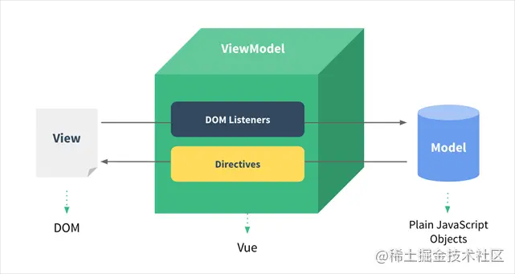

# 关于 Vue 的相关知识

收集一些 vue 相关的东西

### MVVM 的理解

MVVM 是 Model-View-ViewModel 的缩写。Model 代表数据层，可定义修改数据、编写业务逻辑。View 代表视图层，负责将数据渲染成页面。ViewModel 负责监听数据层数据变化，控制视图层行为交互，简单讲，就是同步数据层和视图层的对象。ViewModel 通过双向绑定把 View 和 Model 层连接起来，且同步工作无需人为干涉，使开发人员只关注业务逻辑，无需频繁操作 DOM，不需关注数据状态的同步问题。


### 如何实现 v-model

v-model 指令用于实现 input、select 等表单元素的双向绑定，是个语法糖。
原生 input 元素若是 text/textarea 类型，使用 value 属性和 input 事件。
原生 input 元素若是 radio/checkbox 类型，使用 checked 属性和 change 事件。
原生 select 元素，使用 value 属性和 change 事件。
input 元素上使用 v-model 等价于

```Html
<input :value="message" @input="message = $event.target.value" />
```

### 如何理解 Vue 单向数据流 props

我们经常说 Vue 的双向绑定，其实是在单向绑定的基础上给元素添加 input/change 事件，来动态修改视图。Vue 组件间传递数据仍然是单项的，即父组件传递到子组件。子组件内部可以定义依赖 props 中的值，但无权修改父组件传递的数据，这样做防止子组件意外变更父组件的状态，导致应用数据流向难以理解。

> 如果在子组件内部直接更改 prop，会遇到警告处理。

#### 2 种定义依赖 props 中的值

- 通过 data 定义属性并将 prop 作为初始值。

```javascript
<script>
export default {
 props: ['initialNumber'],
 data() {
   return {
     number: this.initailNumber
   }
 }
}
</script>
```

- 用 computed 计算属性去定义依赖 prop 的值。若页面会更改当前值，得分 get 和 set 方法。

```javascript
<script>
export default {
 props: ['size'],
 computed: {
   normalizedSize() {
     return this.size.trim().toLowerCase()
   }
 }
}
</sciprt>
```

### 关于 Vue.observable 的了解

Vue.observable 可使对象可响应。返回的对象可直接用于渲染函数和计算属性内，并且在发生变更时触发相应的更新。也可以作为最小化的跨组件状态存储器。

> 适用的场景：在项目中没有大量的非父子组件通信时，可以使用 Vue.observable 去替代 eventBus 和 vuex 方案。
> 用法如下

```javascript
// store.js
import Vue from 'vue'
export const state = Vue.observable({
  count: 1
})
export const mutations = {
  setCount(count) {
    state.count = count
  }
}

// vue 文件
<template>
  <div>{{ count }}</div>
</template>
<script>
import { state, mutation } from './store.js'
export default {
  computed: {
    count() {
      return state.count
    }
  }
}
</script>
```

### 组件中的 data 为什么是个函数

在 vue 中，对于组件有一个很明显的特性是在于它是可以被复用的，组件是可以被复用的，那么注册了一个组件本质上就是创建了一个组件构造器的引用，而真正当我们使用组件的时候才会去将组件实例化，

```javascript
// 创建一个组件
class Component {}
const component1 = new Component()
const component2 = new Component()
const data = {
	a: 1,
	b: 2
}
component1.data = data
component2.data = data
component1.data.b = 3
console.log(component1.data.b) // 3
console.log(component2.data.b) // 3
```

通过上面代码可以得知实例化的 component1 和 component2 确是共享同样的 data 对象，所以当你修改 component1 的 data 中的一个属性的时候，component2 中的 data 也会发生改变，这明显不是我们想要的效果。

> 这跟 vue 组件复用，并且里面 data 是独立得相违背 当我们的 data 是一个函数的时候，每一个实例的 data 属性都是独立的，不会相互影响了。于是把data改成function

```javascript
class Component {}
const component1 = new Component()
const component2 = new Component()
// 改造成function形式类似于vue组件的data
const data = function () {
	return {
		a: 1,
		b: 2
	}
}
component1.data = data()
component2.data = data()
component1.data.b = 3
console.log(component1.data.b) // 3
console.log(component2.data.b) // 2
```

### vue 使用展示 md 文件

```text
npm i vue-markdown-loader -D
npm i  vue-loader vue-template-compiler -D
# 样式
npm i github-markdown-css -D
npm i highlight.js -D
```

##### 在 vue.config.js 中配置

```javascript
config.module
	.rule('md')
	.test(/\.md/)
	.use('vue-loader')
	.loader('vue-loader')
	.end()
	.use('vue-markdown-loader')
	.loader('vue-markdown-loader/lib/markdown-compiler')
	.options({
		raw: true
	})
```

##### 具体使用方法

```Html
<template>
	<!-- class markdown-body 必须加，否则标签样式会出现问题 -->
  <div class="markdown-body">
    <markdown />
  </div>
</template>
<script>
// 引入 markdown 文件，引入后是一个组件，需要在 components 中注册
import markdown from 'xxxx.md'
// 代码高亮
import 'highlight.js/styles/github.css'
// 其他元素使用 github 的样式
import 'github-markdown-css'
export default {
  components: {
    markdown
  }
}
</script>
```
