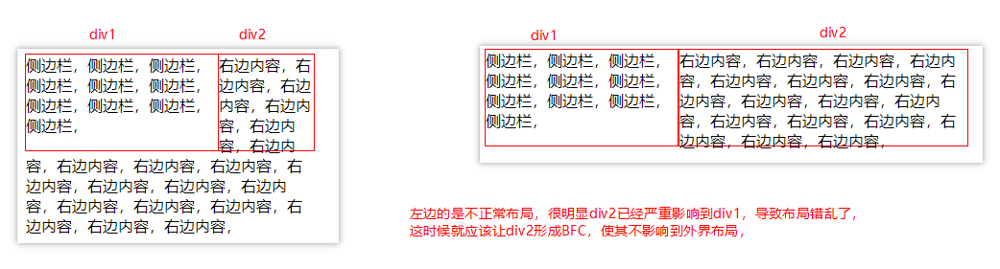
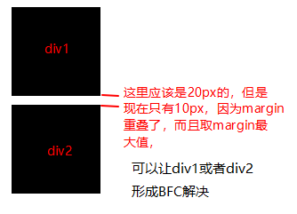
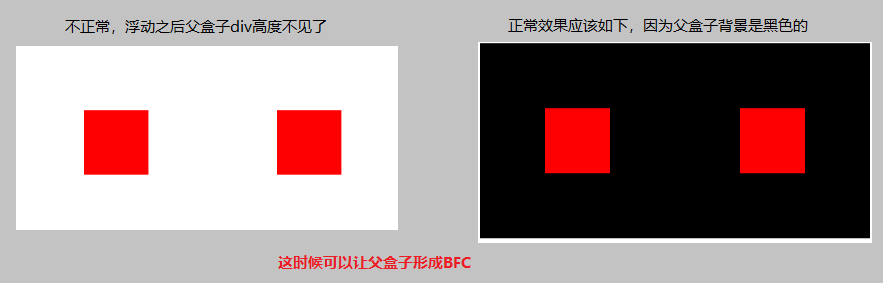

# BFC 块级上下文

## BFC 到底是什么东西

BFC 全称：Block Formatting Context， 名为 "块级格式化上下文"。

W3C 官方解释为：BFC 它决定了元素如何对其内容进行定位，以及与其它元素的关系和相互作用，当涉及到可视化布局时，Block Formatting Context 提供了一个环境，HTML 在这个环境中按照一定的规则进行布局。

简单来说就是，**BFC 是一个完全独立的空间（布局环境），作用是让空间里的元素不会影响到外面的布局**。

## 触发 BFC

也就是说当该元素影响到外面布局的时候，可以触发 BFC，让该元素形成 BFC，不影响到外面布局。
常见触发 BFC 使用的 CSS 属性：

- `overflow: hidden`
- `display: inline-block`
- `position: absolute`
- `position: fixed`
- `display: table-cell`
- `display: flex`

## 举例子

1. 使用 BFC 解决 float 两栏布局，浮动之后布局错乱的问题

```Html
<!DOCTYPE html>
<html lang="en">
<head>
  <meta charset="UTF-8">
  <meta http-equiv="X-UA-Compatible" content="IE=edge">
  <meta name="viewport" content="width=device-width, initial-scale=1.0">
  <title>两栏布局</title>
  <style>
    div {
      width: 200px;
      height: 100px;
      border: 1px solid red;
    }
  </style>
</head>
<body>
  <div style="float: left;">
    侧边栏，侧边栏，侧边栏，侧边栏，侧边栏，侧边栏，侧边栏，侧边栏，侧边栏，侧边栏，
  </div>
  <div style="width: 300px;">
    右边内容，右边内容，右边内容，右边内容，右边内容，右边内容，右边内容，右边内容，右边内容，右边内容，右边内容，右边内容，右边内容，右边内容，右边内容，右边内容，右边内容，
  </div>
</body>
</html>
```



这时候只需要把 div2 的样式设置`display:inline-block;`就可以解决；因为`display:inline-block;`可以触发 BFC

2. 使用 BFC 解决 Margin 边距重叠的问题

```Html
<!DOCTYPE html>
<html lang="en">
<head>
  <meta charset="UTF-8">
  <meta http-equiv="X-UA-Compatible" content="IE=edge">
  <meta name="viewport" content="width=device-width, initial-scale=1.0">
  <title>Document</title>
  <style>
    .box {
        margin: 10px;
        width: 100px;
        height: 100px;
        background: #000;
    }
  </style>
</head>
<body>
  <div class="container">
    <div class="box"></div>
    <div class="box"></div>
  </div>
</body>
</html>
```



使用 p 标签包裹其中一个 div，让其形成 BFC`<p><div class="box"></div></p>`

3. 使用 BFC 解决 Float 脱离文档流，高度塌陷的问题
   例如`container`的高度由两个子元素 div 撑开，但是当子元素 div 使用 float 属性之后，container 的高度不见了

   ```Html
   <!DOCTYPE html>
   <html lang="en">
   <head>
    <meta charset="UTF-8">
    <meta http-equiv="X-UA-Compatible" content="IE=edge">
    <meta name="viewport" content="width=device-width, initial-scale=1.0">
    <title>高度塌陷</title>
    <style>
        .box {
            margin: 100px;
            width: 100px;
            height: 100px;
            background: red;
            float: left;
        }
        .container {
            background: #000;
        }
    </style>
   </head>
   <body>
    <div class="container">
        <div class="box"></div>
        <div class="box"></div>
    </div>
   </body>
   </html>

   ```

   
   给父盒子添加`display: inline-block;`使其触发 BFC 即可显示正常
