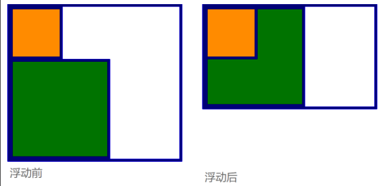
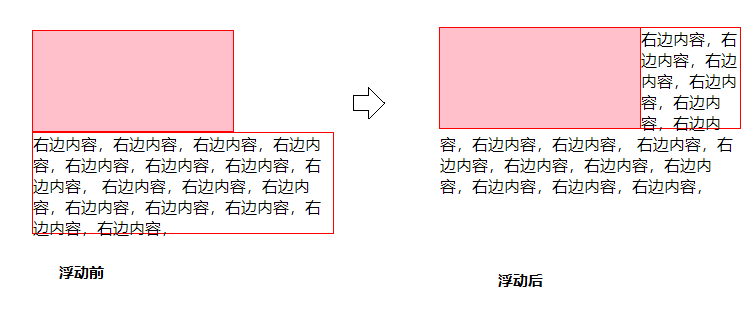
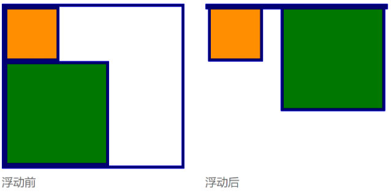

# CSS 清除浮动

我们通常使用浮动来实现某些元素的布局，但是往往这些元素浮动会影响其他元素的布局，因此会产生副作用。

## 浮动带来的副作用

浮动会让元素脱离文档流，不再影响不浮动的元素（这里不影响是指在文档流里头不占位置，后边的元素忽视浮动元素的存在）。实则不然，浮动不再占据文档流的位置，也使浮动元素周围的元素表现的如同浮动元素不存在一样，给布局带来了一些副作用。

### 块状元素，会钻进浮动元素的下面，被浮动元素所覆盖

### 行内元素，例如文字， 则会环绕在浮动元素的周围，为浮动元素留出空间

### 浮动元素的父元素坍缩

## 清浮动方法

1. 利用 clear 属性，包括在浮动元素末尾添加一个带有 clear: both 属性的空 div 来闭合元素，其实利用 :after 伪元素的方法也是在元素末尾添加一个内容为一个点并带有 clear: both 属性的元素实现的。

2. 触发浮动元素父元素的 BFC (Block Formatting Contexts, 块级格式化上下文)，使到该父元素可以包含浮动元素，关于这一点。
