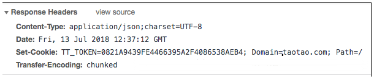

### sso 单点登录之跨域 cookie 共享 （跨域缓存共享）

使用 cookie 的两个属性

#### domain-域

通过设置这个属性可以使多个 web 服务器共享 cookie。domain 属性的默认值是创建 cookie 的服务器的主机名。不能将一个 cookie 的域设置成服务器所在的域 之外的域。
举个例子:
让位于 a.taotao.com 的服务器能够读取 b.taotao.com 设置的 cookie 值。如果 b.taotao.com 的页面创建的 cookie 把 它的 path 属性设置为”/”，把 domain 属性设置成”.taotao.com”，那么所有位于 b.taotao.com 的网页和所有位于 a.taotao.com 的网页，以及位于 taotao.com 域的其他服务器上的网页都可以访问(或者说是得到)这个 cookie。

#### path-路径

表示创建该 cookie 的服务器的 哪些路径下的 文件有权限读取该 cookie,默认为/，就是创建该 cookie 的服务器的根目录
具体实现
A 机 host 设置如下:
127.0.0.1 sso.taotao.com
172.16.30.123 portal.taotao.com
B 机 host 设置如下:
127.0.0.1 portal.taotao.com
172.16.30.123 sso.taotao.com
同时开启两台服务器，sso 为单点登录系统，portal 为门户系统，portal 首页点击登录按钮，可连接到 sso 系统的登录模块，登录成功后，sso 系统设置 cookie 属性如下:

token=“0821A9439FE4466395A2F4086538AEB4”
Cookie cookie = newCookie(“TT_TOKEN”, token);
cookie.setPath("/");
cookie.setDomain(“.taotao.com”);
response.addCookie(cookie);

此时 portal 服务器所在机器的浏览器得到响应信息如下 :

浏览器会根据 cookie 的 domain 属性进行判断访问哪个域会携带这个 cookie,因为 com.taotao.portal 属于.taotao.com 的子域,所以在这个浏览器上访问 portal.taotao.com 服务器下的所有路径都会携带这个 cookie 。
