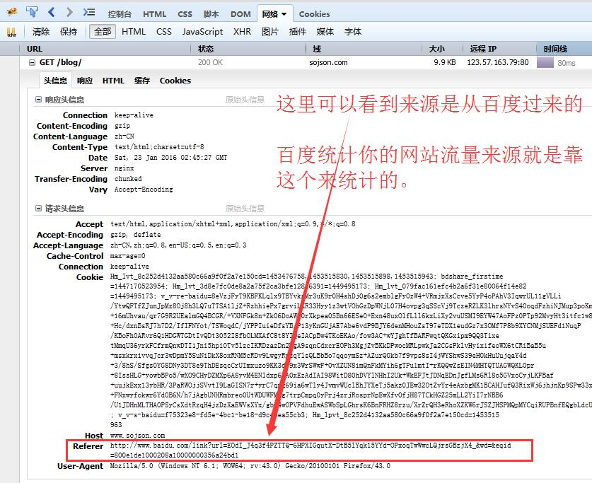

### Referer

#### 什么是 Referer

Referer 是 HTTP 请求 header 的一部分，当浏览器（或者模拟浏览器行为）向 web 服务器发送请求的时候，头信息里有包含 Referer。
比如我在 www.sojson.com 里有一个 www.baidu.com 链接，那么点击这个www.baidu.com ，它的 header 信息里就有：

    Referer=https://www.sojson.com

由此可以看出来吧。它就是表示一个来源。看下图的一个请求的 Referer 信息。

> Referer 的正确英语拼法是 referrer 。由于早期 HTTP 规范的拼写错误，为了保持向后兼容就将错就错了。其它网络技术的规范企图修正此问题，使用正确拼法，所以目前拼法不统一。还有它第一个字母是大写。

#### Referer 的作用

##### 防盗链

我在www.sojson.com里有一个www.baidu.com链接，那么点击这个www.baidu.com，它的header信息里就有：

> Referer=https://www.sojson.com
> 那么可以利用这个来防止盗链了，比如我只允许我自己的网站访问我自己的图片服务器，那我的域名是www.sojson.com，那么图片服务器每次取到Referer来判断一下是不是我自己的域名www.sojson.com，如果是就继续访问，不是就拦截。

##### 防止恶意请求

比如我的 SOJSON 网站上，静态请求是*.html 结尾的，动态请求是*.shtml，那么由此可以这么用，所有的\*.shtml 请求，必须 Referer 为我自己的网站。

> Referer=https://www.sojson.com
