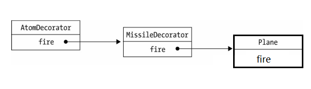

# JavaScript 设计模式之装饰者模式

参考[使用装饰者模式做有趣的事情](https://juejin.cn/post/6844903673756123144#heading-0)
参考[JavaScript 设计模式之装饰者模式](https://juejin.cn/post/6844904016279765000#heading-7)
参考[5 分钟即可掌握的 JavaScript 装饰者模式与 AOP](https://juejin.cn/post/6844903873262387208#heading-7)

## 什么是 AOP

想必大家对"餐前洗手、饭后漱口"都不陌生。这句标语其实就是 AOP 在生活中的例子：吃饭这个动作相当于切点，我们可以在这个切点前、后插入其它如洗手等动作。
AOP（Aspect-Oriented Programming）：面向切面编程，是对 OOP 的补充。利用 AOP 可以对业务逻辑的各个部分进行隔离，也可以隔离业务无关的功能比如日志上报、异常处理等，从而使得业务逻辑各部分之间的耦合度降低，提高业务无关的功能的复用性，也就提高了开发的效率。
在 JavaScript 中，我们可以通过装饰者模式来实现 AOP，但是两者并不是一个维度的概念。**AOP 是一种编程范式，而装饰者是一种设计模式**。

## 什么是装饰者模式

在传统的面向对象(OOP)语言中，给对象添加功能常常使用继承的方式，但是继承的方式并不灵活，还会带来许多问题：一方面会导致超类和子类之间存在强耦合性，当超类改变时，子类也会随之改变；另一方面，继承这种功能复用方式通常被称为“白箱复用”，“白箱”是相对可见性而言的，在继承方式中，超类的内部细节是对子类可见的，继承常常被认为破坏了封装性。

使用继承还会带来另外一个问题，在完成一些功能复用的同时，有可能创建出大量的子类，使子类的数量呈爆炸性增长。比如现在有 4 种型号的自行车，我们为每种自行车都定义了一个单独的类。现在要给每种自行车都装上前灯、尾灯和铃铛这 3 种配件。如果使用继承的方式来给每种自行车创建子类，则需要 4×3=12 个子类。但是如果把前灯、尾灯、铃铛这些对象动态组合到自行车上面，则只需要额外增加 3 个类。

这种给对象动态地增加职责的方式称为装饰者（decorator）模式。装饰者模式能够在不改变对象自身的基础上，在程序运行期间给对象动态地添加职责。跟继承相比，装饰者是一种更轻便灵活的做法，这是一种“即用即付”的方式，比如天冷了就多穿一件外套，需要飞行时就在头上插一支竹蜻蜓，遇到一堆食尸鬼时就点开 AOE（范围攻击）技能

当我们拍了一张照片准备发朋友圈时，许多小伙伴会选择给照片加上滤镜。同一张照片、不同的滤镜组合起来就会有不同的体验。这里实际上就应用了装饰者模式：是通过滤镜装饰了照片。在不改变对象（照片）的情况下动态的为其添加功能（滤镜）；这就是生活中装饰者模式的例子了。

自行车的基类如下：

```js
class Bicycle {
	// 其它方法
	wash() {}
	ride() {}
	getPrice() {
		return 200
	}
}
```

装饰者模式基类

```js
class BicycleDecotator {
	constructor(bicycle) {
		this.bicycle = bicycle
	}
	wash() {
		return this.bicycle.wash()
	}
	ride() {
		return this.bicycle.ride()
	}
	getPrice() {
		return this.bicycle.getPrice()
	}
}
```

这个基类其实没有做什么事情，**它只是接受一个 Bicycle 实例，实现其对应的方法，并且将调用其方法返回而已**。

有了这个基类之后，我们就可以根据我们的需求对原来的 Bicycle 类为所欲为了。比如我可以创建一个添加了前灯的装饰器以及添加了尾灯的装饰器：

```js
class HeadLightDecorator extends BicycleDecorator {
	constructor(bicycle) {
		super(bicycle)
	}
	getPrice() {
		return this.bicycle.getPrice() + 20
	}
}
class TailLightDecorator extends BicycleDecorator {
	constructor(bicycle) {
		super(bicycle)
	}
	getPrice() {
		return this.bicycle.getPrice() + 20
	}
}
```

接下来我们就可以来对其自由组合了:

```js
let bicycle = new Bicycle()
console.log(bicycle.getPrice()) // 200
bicycle = new HeadLightDecorator(bicycle) // 添加了前灯的自行车
console.log(bicycle.getPrice()) // 220
bicycle = new TailLightDecorator(bicycle) // 添加了前灯和尾灯的自行车
console.log(bicycle.getPrice()) // 240
```

**这样写的好处是什么呢?假设说我们有 10 个配件，那么我们只需要写 10 个配件装饰器，然后就可以任意搭配成不同配件的自行车并计算价格。而如果是按照子类的实现方式的话，10 个配件可能就需要有几百个甚至上千个子类了**

从例子中我们可以看出装饰者模式的适用场合：

1. 如果你需要为类增添特性或职责，可是从类派生子类的解决方法并不太现实的情况下，就应该使用装饰者模式。
2. 在例子中，我们并没有对原来的 Bicycle 基类进行修改，因此也不会对原有的代码产生副作用。我们只是在原有的基础上增添了一些功能。因此，如果想为对象增添特性又不想改变使用该对象的代码的话，则可以采用装饰者模式。

又例如拍照的时候要加上各种各样的滤镜

```js
// 相机拍照的时候要加上各种各样的滤镜
class Camera {
	constructor(photo) {
		this.photo = photo
	}
	// 拍照
	takePhoto() {
		return this.photo
	}
}
// 滤镜装饰基类
class FilterDecotator {
	constructor(camera) {
		this.camera = camera
	}
	takePhoto() {
		return this.camera.takePhoto()
	}
}
// 港风滤镜
class HongkongFilterDecotator extends FilterDecotator {
	constructor(camera) {
		super(camera)
	}
	takePhoto() {
		return this.camera.takePhoto() + ' 港风滤镜；'
	}
}
// 日系滤镜
class JapaneseFilterDecotator extends FilterDecotator {
	constructor(camera) {
		super(camera)
	}
	takePhoto() {
		return this.camera.takePhoto() + ' 日系滤镜；'
	}
}
let camera = new Camera('美女靓照')
console.log(camera.takePhoto())
camera = new HongkongFilterDecotator(camera) // 添加了港风滤镜
console.log(camera.takePhoto())
camera = new JapaneseFilterDecotator(camera) // 添加了日系滤镜
console.log(camera.takePhoto()) // 美女靓照 港风滤镜； 日系滤镜；
```

**装饰者模式除了可以应用在类上之外，还可以应用在函数上（其实这就是高阶函数）**。比如，我们想测量函数的执行时间，那么我可以写这么一个装饰器：

```js
function func() {
	console.log('func')
}
function timeProfileDecorator(func) {
	return function (...args) {
		const startTime = new Date()
		func.call(this, ...args)
		const elapserdTime = new Date().getTime() - startTime.getTime()
		console.log(`该函数消耗了${elapserdTime}ms`)
	}
}
const newFunc = timeProfileDecorator(func)
console.log(newFunc())
```

## 模拟传统面向对象语言的装饰者模式

首先要提出来的是，作为一门解释执行的语言，给 JavaScript 中的对象动态添加或者改变职责是一件再简单不过的事情，虽然这种做法改动了对象自身，跟传统定义中的装饰者模式并不一样，但这无疑更符合 JavaScript 的语言特色。代码如下：

```js
var obj = {
	name: 'sven',
	address: '深圳市'
}
obj.address = obj.address + '福田区'
```

传统面向对象语言中的装饰者模式在 JavaScript 中适用的场景并不多，如上面代码所示，通常我们并不太介意改动对象自身。尽管如此，但是我们还是稍微模拟一下传统面向对象语言中的装饰者模式实现。

假设我们在编写一个飞机大战的游戏，随着经验值的增加，我们操作的飞机对象可以升级成更厉害的飞机，一开始这些飞机只能发射普通的子弹，升到第二级时可以发射导弹，升到第三级时可以发射原子弹。

```js
// 建立一架飞机
var Plane = function () {}
// 飞机有发射普通子弹的方法
Plane.prototype.fire = function () {
	console.log('发射普通子弹')
}
```

接下来增加两个装饰类，分别是导弹和原子弹：

```js
var MissileDecorator = function (plane) {
	this.plane = plane
}
MissileDecorator.prototype.fire = function () {
	this.plane.fire()
	console.log('发射导弹')
}
var AtomDecorator = function (plane) {
	this.plane = plane
}
AtomDecorator.prototype.fire = function () {
	this.plane.fire()
	console.log('发射原子弹')
}
```

导弹类和原子弹类的构造函数都接受参数 plane 对象，并且保存好这个参数，在它们的 fire 方法中，除了执行自身的操作之外，还调用 plane 对象的 fire 方法。

**这种给对象动态增加职责的方式，并没有真正地改动对象自身，而是将对象放入另一个对象之中，这些对象以一条链的方式进行引用，形成一个聚合对象**。这些对象都拥有相同的接口（fire 方法），当请求达到链中的某个对象时，这个对象会执行自身的操作，随后把请求转发给链中的下一个对象。

**因为装饰者对象和它所装饰的对象拥有一致的接口**，所以它们对使用该对象的客户来说是透明的，被装饰的对象也并不需要了解它曾经被装饰过，这种透明性使得我们可以递归地嵌套任意多个装饰者对象，如图所示。


最后看看测试结果：

```js
var plane = new Plane()
plane = new MissileDecorator(plane)
plane = new AtomDecorator(plane)
plane.fire()
// 分别输出： 发射普通子弹、发射导弹、发射原子弹
```

## 回到 JavaScript 的装饰者

JavaScript 语言动态改变对象相当容易，我们可以直接改写对象或者对象的某个方法，并不需要使用“类”来实现装饰者模式，代码如下：

```js
var plane = {
	fire: function () {
		console.log('发射普通子弹')
	}
}
var missileDecorator = function () {
	console.log('发射导弹')
}
var atomDecorator = function () {
	console.log('发射原子弹')
}
var fire1 = plane.fire
plane.fire = function () {
	fire1()
	missileDecorator()
}
var fire2 = plane.fire
plane.fire = function () {
	fire2()
	atomDecorator()
}
plane.fire()
// 分别输出： 发射普通子弹、发射导弹、发射原子弹
```

## 装饰函数

在 JavaScript 中，几乎一切都是对象，其中函数又被称为一等对象。在平时的开发工作中，也许大部分时间都在和函数打交道。在 JavaScript 中可以很方便地给某个对象扩展属性和方法，但却很难在不改动某个函数源代码的情况下，给该函数添加一些额外的功能。在代码的运行期间，我们很难切入某个函数的执行环境。

**要想为函数添加一些功能，最简单粗暴的方式就是直接改写该函数，但这是最差的办法，直接违反了开放-封闭原则**：

```js
var a = function () {
	alert(1)
}
// 改成：
var a = function () {
	alert(1)
	alert(2)
}
```

很多时候我们不想去碰原函数，也许原函数是由其他同事编写的，里面的实现非常杂乱。甚至在一个古老的项目中，这个函数的源代码被隐藏在一个我们不愿碰触的阴暗角落里。现在需要一个办法，在不改变函数源代码的情况下，能给函数增加功能，这正是开放-封闭原则给我们指出的光明道路。

通过保存原引用的方式就可以改写某个函数：

```js
var a = function () {
	alert(1)
}
var _a = a
a = function () {
	_a()
	alert(2)
}
a()
```

这是实际开发中很常见的一种做法，比如我们想给 `window` 绑定 `onload` 事件，但是又不确定这个事件是不是已经被其他人绑定过，为了避免覆盖掉之前的` window.onload` 函数中的行为，我们一般都会先保存好原先的 `window.onload`，把它放入新的 `window.onload` 里执行：

```js
window.onload = function () {
	alert(1)
}
var _onload = window.onload || function () {}
window.onload = function () {
	_onload()
	alert(2)
}
```

这样的代码当然是符合开放-封闭原则的，我们在增加新功能的时候，确实没有修改原来的 `window.onload` 代码，但是这种方式存在以下两个问题。

- 必须维护`_onload` 这个中间变量，虽然看起来并不起眼，但如果函数的装饰链较长，或者需要装饰的函数变多，这些中间变量的数量也会越来越多。
- 其实还遇到了 this 被劫持的问题，在 `window.onload `的例子中没有这个烦恼，是因为调用普通函数`_onload` 时，this 也指向 window，跟调用 `window.onload` 时一样（函数作为对象的方法被调用时，this 指向该对象，所以此处 this 也只指向 window）。现在把 `window.onload` 换成 `document.getElementById`，代码如下:

```js
var _getElementById = document.getElementById
document.getElementById = function (id) {
	alert(1)
	return _getElementById(id) // (1)
}
var button = document.getElementById('button')
```

执行这段代码，我们看到在弹出 alert(1)之后，紧接着控制台抛出了异常：

```js
// 输出： Uncaught TypeError: Illegal invocation
```

异常发生在(1) 处的`_getElementById(id)`这句代码上，此时`_getElementById` 是一个全局函数，当调用一个全局函数时，this 是指向 window 的，而 `document.getElementById` 方法的内部实现需要使用 this 引用，this 在这个方法内预期是指向 document，而不
是 window, 这是错误发生的原因，所以使用现在的方式给函数增加功能并不保险。

改进后的代码可以满足需求，我们要手动把 document 当作上下文 this 传入`_getElementById`：

```html
<html>
	<button id="button"></button>
	<script>
		var _getElementById = document.getElementById
		document.getElementById = function () {
			alert(1)
			return _getElementById.apply(document, arguments)
		}
		var button = document.getElementById('button')
	</script>
</html>
```

**但这样做显然很不方便，下面我们引入 AOP，来提供一种完美的方法给函数动态增加功能**

## 用 AOP 装饰函数

首先给出 Function.prototype.before 方法和 Function.prototype.after 方法：

```js
Function.prototype.before = function (beforefn) {
	var __self = this // 保存原函数的引用
	return function () {
		// 返回包含了原函数和新函数的"代理"函数
		beforefn.apply(this, arguments) // 执行新函数，且保证this不被劫持，新函数接受的参数
		// 也会被原封不动地传入原函数，新函数在原函数之前执行
		return __self.apply(this, arguments) // 执行原函数并返回原函数的执行结果，
		// 并且保证this不被劫持
	}
}
Function.prototype.after = function (afterfn) {
	var __self = this
	return function () {
		var ret = __self.apply(this, arguments)
		afterfn.apply(this, arguments)
		return ret
	}
}
```

`Function.prototype.before`接受一个函数当作参数，这个函数即为新添加的函数，它装载了新添加的功能代码。

接下来把当前的 this 保存起来，这个 this 指向原函数，然后返回一个“代理”函数，这个“代理”函数只是结构上像代理而已，并不承担代理的职责（比如控制对象的访问等）。它的工作是把请求分别转发给新添加的函数和原函数，且负责保证它们的执行顺序，让新添加的函数在原函数之前执行（前置装饰），这样就实现了动态装饰的效果。

我们注意到，通过`Function.prototype.apply`来动态传入正确的 this，保证了函数在被装饰之后，this 不会被劫持。

`Function.prototype.after`的原理跟`Function.prototype.before`一模一样，唯一不同的地方在于让新添加的函数在原函数执行之后再执行。

下面来试试用 Function.prototype.before 的威力:

```html
<html>
	<button id="button"></button>
	<script>
		Function.prototype.before = function (beforefn) {
			var __self = this
			return function () {
				beforefn.apply(this, arguments)
				return __self.apply(this, arguments)
			}
		}
		document.getElementById = document.getElementById.before(function () {
			alert(1)
		})
		var button = document.getElementById('button')
		console.log(button)
	</script>
</html>
```

再回到 window.onload 的例子，看看用 Function.prototype.after 来增加新的 window.onload 事件是多么简单：

```js
window.onload = function () {
	alert(1)
}
window.onload = (window.onload || function () {})
	.after(function () {
		alert(2)
	})
	.after(function () {
		alert(3)
	})
	.after(function () {
		alert(4)
	})
```

值得提到的是，上面的 AOP 实现是在`Function.prototype`上添加 before 和 after 方法，但许多人不喜欢这种污染原型的方式，那么我 们可以做一些变通，把原函数和新函数都作为参数传入 before 或者 after 方法：

```js
var before = function (fn, beforefn) {
	return function () {
		beforefn.apply(this, arguments)
		return fn.apply(this, arguments)
	}
}
var a = before(
	function () {
		alert(3)
	},
	function () {
		alert(2)
	}
)
a = before(a, function () {
	alert(1)
})
a()
```

## AOP 的应用实例

用 AOP 装饰函数的技巧在实际开发中非常有用。不论是业务代码的编写，还是在框架层面，我们都可以把行为依照职责分成粒度更细的函数，随后通过装饰把它们合并到一起，这有助于我们编写一个松耦合和高复用性的系统。

这一节将介绍几个例子，带大家进一步理解装饰函数的威力。

### 数据统计上报

分离业务代码和数据统计代码，无论在什么语言中，都是 AOP 的经典应用之一。在项目开发的结尾阶段难免要加上很多统计数据的代码，这些过程可能让我们被迫改动早已封装好的函数。

比如页面中有一个登录 button，点击这个 button 会弹出登录浮层，与此同时要进行数据上报，来统计有多少用户点击了这个登录 button：

```html
<html>
	<button tag="login" id="button">点击打开登录浮层</button>
	<script>
		var showLogin = function () {
			console.log('打开登录浮层')
			log(this.getAttribute('tag'))
		}
		var log = function (tag) {
			console.log('上报标签为: ' + tag)
			// (new Image).src = 'http:// xxx.com/report?tag=' + tag; // 真正的上报代码略
		}
		document.getElementById('button').onclick = showLogin
	</script>
</html>
```

我们看到在 showLogin 函数里，既要负责打开登录浮层，又要负责数据上报，这是两个层面的功能，在此处却被耦合在一个函数里。使用 AOP 分离之后，代码如下：

```html
<html>
	<button tag="login" id="button">点击打开登录浮层</button>
	<script>
		Function.prototype.after = function (afterfn) {
			var __self = this
			return function () {
				var ret = __self.apply(this, arguments)
				afterfn.apply(this, arguments)
				return ret
			}
		}
		var showLogin = function () {
			console.log('打开登录浮层')
		}
		var log = function () {
			console.log('上报标签为: ' + this.getAttribute('tag'))
		}
		showLogin = showLogin.after(log) // 打开登录浮层之后上报数据
		document.getElementById('button').onclick = showLogin
	</script>
</html>
```

### 节流函数 or 防抖函数

```js
function throttle(func, delay) {
	const self = this
	let tid
	return function (...args) {
		if (tid) return
		tid = setTimeout(() => {
			func.call(self, ...args)
			tid = null
		}, delay)
	}
}

function debounce(func, delay) {
	const self = this
	let tid
	return function (...args) {
		if (tid) clearTimeout(tid)
		tid = setTimeout(() => {
			func.call(self, ...args)
			tid = null
		}, delay)
	}
}
```

### 缓存函数返回值

```js
// 缓存函数结果，对于一些计算量比较大的函数效果比较明显。
function memorize(func) {
	const cache = {}
	return function (...args) {
		const key = JSON.stringify(args)
		if (cache[key]) {
			console.log('缓存了')
			return cache[key]
		}
		const result = func.call(this, ...args)
		cache[key] = result
		return result
	}
}

function fib(num) {
	return num < 2 ? num : fib(num - 1) + fib(num - 2)
}

const enhanceFib = memorize(fib)
console.log(enhanceFib(40))
console.log(enhanceFib(40))
console.log(enhanceFib(40))
console.log(enhanceFib(40))
```

### 构造 React 高阶组件,为组件增加额外的功能，比如为组件提供 shallowCompare 功能：

```js
import React from 'react'
const { Component } = react

const ShadowCompareDecorator = Instance =>
	class extends Component {
		shouldComponentUpdate(nextProps, nextState) {
			return !shallowCompare(this.props, nextProps) || !shallowCompare(this.state, nextState)
		}
		render() {
			return <Instance {...this.props} />
		}
	}

export default ShadowCompareDecorator
```

## 用 AOP 动态改变函数的参数

观察 `Function.prototype.before` 方法：

```js
Function.prototype.before = function (beforefn) {
	var __self = this
	return function () {
		beforefn.apply(this, arguments) // (1)
		return __self.apply(this, arguments) // (2)
	}
}
```

从这段代码的(1)处和(2)处可以看到，beforefn 和原函数**self 共用一组参数列表 arguments，当我们在 beforefn 的函数体内改变 arguments 的时候，原函数**self 接收的参数列表自然也会变化。

下面的例子展示了如何通过 `Function.prototype.before` 方法给函数 func 的参数 param 动态地添加属性 b：

```js
var func = function (param) {
	console.log(param) // 输出： {a: "a", b: "b"}
}
func = func.before(function (param) {
	param.b = 'b'
})
func({ a: 'a' })
```

现在有一个用于发起 ajax 请求的函数，这个函数负责项目中所有的 ajax 异步请求：

```js
var ajax = function (type, url, param) {
	console.dir(param)
	// 发送ajax请求的代码略
}
ajax('get', 'http:// xxx.com/userinfo', { name: 'sven' })
```

上面的伪代码表示向后台 cgi 发起一个请求来获取用户信息，传递给 cgi 的参数是{ name: 'sven' }

ajax 函数在项目中一直运转良好，跟 cgi 的合作也很愉快。直到有一天，我们的网站遭受了 CSRF 攻击。解决 CSRF 攻击最简单的一个办法就是在 HTTP 请求中带上一个 Token 参数。

假设我们已经有一个用于生成 Token 的函数

```js
var getToken = function () {
	return 'Token'
}
```

现在的任务是给每个 ajax 请求都加上 Token 参数：

```js
var ajax = function (type, url, param) {
	param = param || {}
	Param.Token = getToken() // 发送ajax请求的代码略...
}
```

虽然已经解决了问题，但我们的 ajax 函数相对变得僵硬了，每个从 ajax 函数里发出的请求都自动带上了 Token 参数，虽然在现在的项目中没有什么问题，但如果将来把这个函数移植到其他项目上，或者把它放到一个开源库中供其他人使用，Token 参数都将是多余的。

也许另一个项目不需要验证 Token，或者是 Token 的生成方式不同，无论是哪种情况，都必须重新修改 ajax 函数。

为了解决这个问题，先把 ajax 函数还原成一个干净的函数：

```js
var ajax = function (type, url, param) {
	console.log(param) // 发送ajax请求的代码略
}
```

然后把 Token 参数通过 Function.prototyte.before 装饰到 ajax 函数的参数 param 对象中：

```js
var getToken = function () {
	return 'Token'
}
ajax = ajax.before(function (type, url, param) {
	param.Token = getToken()
})
ajax('get', 'http:// xxx.com/userinfo', { name: 'sven' })
```

从 ajax 函数打印的 log 可以看到，Token 参数已经被附加到了 ajax 请求的参数中：

```js
{name: "sven", Token: "Token"}
```

明显可以看到，用 AOP 的方式给 ajax 函数动态装饰上 Token 参数，保证了 ajax 函数是一个相对纯净的函数，提高了 ajax 函数的可复用性，它在被迁往其他项目的时候，不需要做任何修改。

## 区分装饰者模式和代理模式

装饰者模式和代理模式的结构看起来非常相像，这两种模式都描述了怎样为对象提供一定程度上的间接引用，它们的实现部分都保留了对另外一个对象的引用，并且向那个对象发送请求。

代理模式和装饰者模式最重要的区别在于它们的意图和设计目的。代理模式的目的是，当直接访问本体不方便或者不符合需要时，为这个本体提供一个替代者。本体定义了关键功能，而代理提供或拒绝对它的访问，或者在访问本体之前做一些额外的事情。装饰者模式的作用就是为对象动态加入行为。换句话说，代理模式强调一种关系（Proxy 与它的实体之间的关系），这种关系可以静态的表达，也就是说，这种关系在一开始就可以被确定。而装饰者模式用于一开始不能确定对象的全部功能时。代理模式通常只有一层代理-本体的引用，而装饰者模式经常会形成一条长长的装饰链。

在虚拟代理实现图片预加载的例子中，本体负责设置 img 节点的 src，代理则提供了预加载的功能，这看起来也是“加入行为”的一种方式，但这种加入行为的方式和装饰者模式的偏重点是不一样的。装饰者模式是实实在在的为对象增加新的职责和行为，而代理做的事情还是跟本体一样，最终都是设置 src。但代理可以加入一些“聪明”的功能，比如在图片真正加载好之前，先使用一张占位的 loading 图片反馈给客户。

## 使用 ES7 修饰器实现装饰者

### 拍照滤镜

```js
function after(target, key, desc) {
	const { value } = desc
	desc.value = function (...args) {
		let res = value.apply(this, args)
		console.log('加滤镜')
		return res
	}
	return desc
}

class Test {
	@after
	takePhoto() {
		console.log('拍照')
	}
}

let t = new Test()
t.takePhoto()
```

### 性能上报

```js
function report(target, key, desc) {
	const { value } = desc
	desc.value = async function (...args) {
		let start = Date.now()
		let res = await value.apply(this, args)
		let millis = Date.now() - start
		// 上报代码
		return res
	}
	return desc
}

class Test {
	@report
	getData(url) {
		// fetch 代码
	}
}

let t = new Test()
t.getData()
```

### 异常处理

```js
function handleError(target, key, desc) {
	const { value } = desc
	desc.value = async function (...args) {
		let res
		try {
			res = await value.apply(this, args)
		} catch (err) {
			// 异常处理
			logger.error(err)
		}
		return res
	}
	return desc
}

class Test {
	@handleError
	getData(url) {
		// fetch 代码
	}
}

let t = new Test()
t.getData()
```

## 结语

通过数据上报、统计函数的执行时间、动态改变函数参数例子，我们了解了装饰函数，它是 JavaScript 中独特的装饰者模式。这种模式在实际开发中非常有用，除了上面提到的例子，它在框架开发中也十分有用。作为框架作者，我们希望框架里的函数提供的是一些稳定而方便移植的功能，那些个性化的功能可以在框架之外动态装饰上去，这可以避免为了让框架拥有更多的功能，而去使用
一些 if、else 语句预测用户的实际需要。
