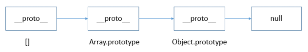
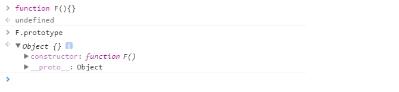
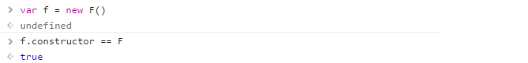
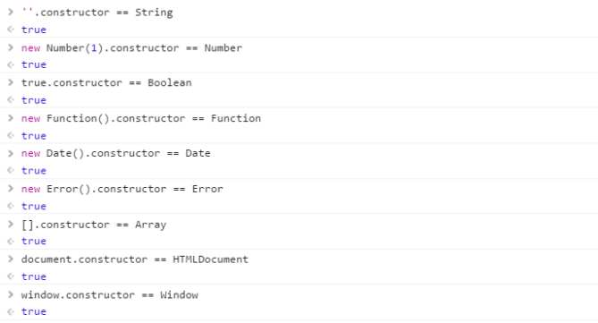

# 判断 JS 数据类型的四种方法

## typeof

typeof 是一个操作符，其右侧跟一个一元表达式，并返回这个表达式的数据类型。返回的结果用该类型的字符串(全小写字母)形式表示，包括以下 7 种：number、boolean、symbol、string、object、undefined、function 等

- 对于基本类型，除 null 以外，均可以返回正确的结果。
- 对于引用类型，除 function 以外，一律返回 object 类型。

```js
typeof '' // string 有效
typeof 1 // number 有效
typeof Symbol() // symbol 有效
typeof true //boolean 有效
typeof undefined //undefined 有效
typeof null //object 无效
typeof [] //object 无效
typeof new Function() // function 有效
typeof new Date() //object 无效
typeof new RegExp() //object 无效
```

## instanceof

instanceof 是用来判断 A 是否为 B 的实例，表达式为：A instanceof B，如果 A 是 B 的实例，则返回 true,否则返回 false。 在这里需要特别注意的是：instanceof 检测的是原型，

```js
instanceof (A,B) = {
    var L = A.__proto__;
    var R = B.prototype;
    if(L === R) {
        // A的内部属性 __proto__ 指向 B 的原型对象
        return true;
    }
    return false;
}
```

从上述过程可以看出，当 A 的 **proto** 指向 B 的 prototype 时，就认为 A 就是 B 的实例，

```js
[] instanceof Array; // true
{} instanceof Object;// true
new Date() instanceof Date;// true

function Person(){};
new Person() instanceof Person;

[] instanceof Object; // true
new Date() instanceof Object;// true
new Person instanceof Object;// true
```

我们发现，虽然 instanceof 能够判断出 [ ] 是 Array 的实例，但它认为 [ ] 也是 Object 的实例，为什么呢？

我们来分析一下 [ ]、Array、Object 三者之间的关系：

从 instanceof 能够判断出 [ ].**proto** 指向 Array.prototype，而 Array.prototype.**proto** 又指向了 Object.prototype，最终 Object.prototype.**proto** 指向了 null，标志着原型链的结束。因此，[]、Array、Object 就在内部形成了一条原型链：



因此，instanceof 只能用来判断两个对象是否属于实例关系， 而不能判断一个对象实例具体属于哪种类型。

## constructor

当一个函数 F 被定义时，JS 引擎会为 F 添加 prototype 原型，然后再在 prototype 上添加一个 constructor 属性，并让其指向 F 的引用。如下所示：



当执行 var f = new F() 时，F 被当成了构造函数，f 是 F 的实例对象，此时 F 原型上的 constructor 传递到了 f 上，因此 f.constructor == F



可以看出，F 利用原型对象上的 constructor 引用了自身，当 F 作为构造函数来创建对象时，原型上的 constructor 就被遗传到了新创建的对象上， 从原型链角度讲，构造函数 F 就是新对象的类型。这样做的意义是，让新对象在诞生以后，就具有可追溯的数据类型。



> 1.  null 和 undefined 是无效的对象，因此是不会有 constructor 存在的，这两种类型的数据需要通过其他方式来判断。
> 2.  函数的 constructor 是不稳定的，这个主要体现在自定义对象上，当开发者重写 prototype 后，原有的 constructor 引用会丢失，constructor 会默认为 Object

## toString

toString() 是 Object 的原型方法，调用该方法，默认返回当前对象的 [[Class]] 。这是一个内部属性，其格式为 [object Xxx] ，其中 Xxx 就是对象的类型。

对于 Object 对象，直接调用 toString() 就能返回 [object Object] 。而对于其他对象，则需要通过 call / apply 来调用才能返回正确的类型信息。

```js
Object.prototype.toString.call('') // [object String]
Object.prototype.toString.call(1) // [object Number]
Object.prototype.toString.call(true) // [object Boolean]
Object.prototype.toString.call(Symbol()) //[object Symbol]
Object.prototype.toString.call(undefined) // [object Undefined]
Object.prototype.toString.call(null) // [object Null]
Object.prototype.toString.call(new Function()) // [object Function]
Object.prototype.toString.call(new Date()) // [object Date]
Object.prototype.toString.call([]) // [object Array]
Object.prototype.toString.call(new RegExp()) // [object RegExp]
Object.prototype.toString.call(new Error()) // [object Error]
Object.prototype.toString.call(document) // [object HTMLDocument]
Object.prototype.toString.call(window) //[object global] window 是全局对象 global 的引用
```
