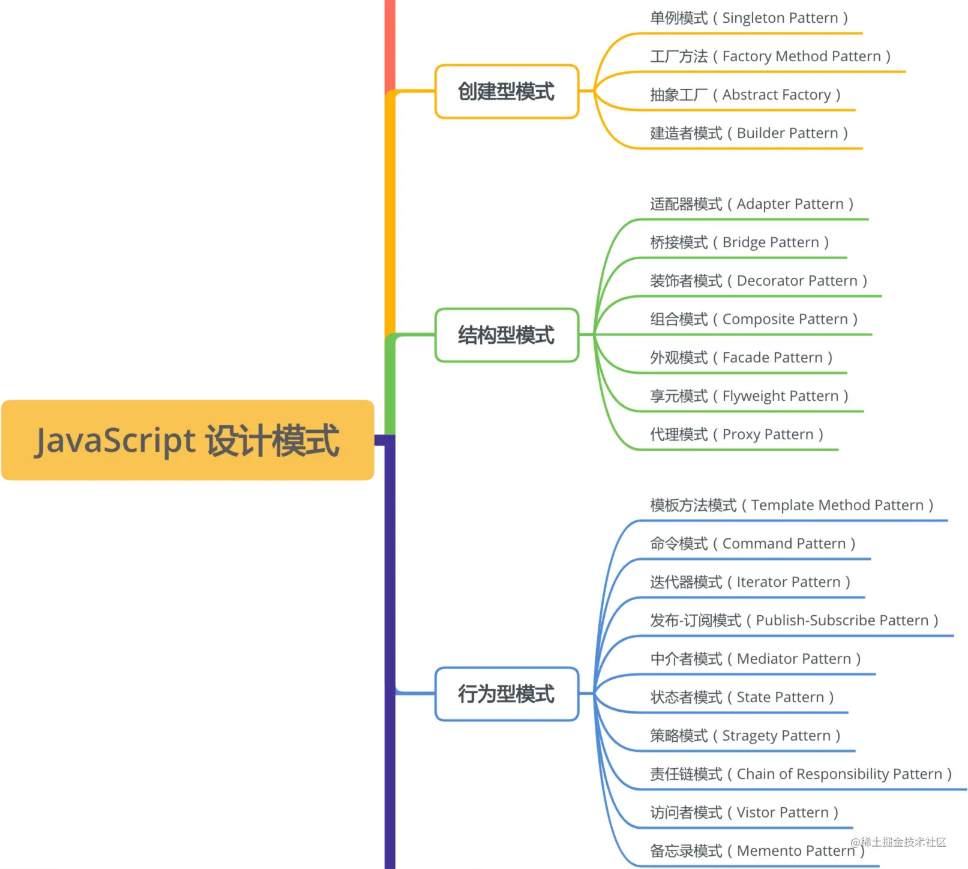

# Javascript 设计模式概览

## 创建型模式

- 单例模式（Singleton Pattern）
- 工厂方法（Factory Method Pattern）
- 抽象工厂（Abstract Factory）
- 建造者模式（Builder Pattern）

## 结构性模式

- 适配器模式（Adapter Pattern）
- 桥接模式（Bridge Pattern）
- 装饰者模式（Decorator Pattern）
- 组合模式（Componsite Pattern）
- 外观模式（Facade Pattern）
- 享元模式（Flyweight Pattern）
- 代理模式（Proxy Pattern）

## 行为模式

- 模板方式模式（Template Method Pattern）
- 命令模式（Command Pattern）
- 迭代器模式（Iterator Pattern）
- 发布-订阅模式（Public-Subscribe Pattern）
- 中介者模式（Mediator Pattern）
- 状态者模式（State Pattern）
- 策略模式（Stragety Pattern）
- 责任链模式（Chain of Responsibility Pattern）
- 访问者模式（Visitor Pattern）
- 备忘录模式（Memento Pattern）
