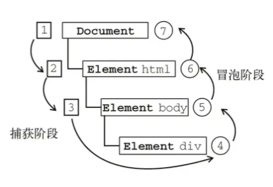

# 事件冒泡、事件捕获、事件委托、事件绑定

## DOM 事件流

事件流描述的是从页面中接收事件的顺序

**事件发生时会在元素节点之间按照特定的顺序传播，这个传播过程即 DOM 事件流**

包括三个阶段：`事件捕获阶段`、`处于目标阶段`、`事件冒泡阶段`



在 dom 模型中，html 是多层次的，当一个 html 元素上产生事件时，该事件会在 dom 树元素节点之间按照特定的顺序去传播。传播路径的每一个节点，都会收到这个事件，这就是 dom 事件流。

`事件捕获`：事件从最不精确的对象(document 对象)开始触发，直到事件目标。

`事件目标`：当到达目标元素之后，执行目标元素该事件相应的处理函数。如果没有绑定监听函数，那就不执行。

`事件冒泡`：事件从事件目标到最不特定的事件目标(document 对象)的顺序触发。

### 注意：

- 代码只能执行捕获或者冒泡其中的一个阶段
- `onclick` 和 `attachEvent` 只能得到冒泡阶段
- `addEventListener (type, listener[, useCapture])` 第三个参数如果是 `true`，表示在事件捕获阶段调用事件处理程序；如果是 `false`（不写默认就是 `false`），表示在事件冒泡阶段处理程序。
- 在实际开发中，我们很少使用事件捕获(低版本 ie 不兼容)，我们更关注事件冒泡
- 有些事件是没有冒泡的，比如 `onblur`、`onfocus`、`onmouseover`、`onmouseleave`
- 虽然事件冒泡有时候会带来麻烦，但是有时候又会巧妙的做某些事情，我们后面讲解

## 事件对象

- event 就是一个事件对象，写道我们的侦听函数的小括号里面，当形参来看
- 事件对象只有有了事件才会存在，他是系统给我们自动创建的，不需要我们传递参数
- 事件对象是我们的事件的一系列相关数据的集合，比如鼠标点击里面就包含了鼠标的相关信息
- 这个事件对象我们可以自己命名，比如 event、evt 、e 等
- 事件对象也有兼容性问题。 IE 6、7、8 通过 window.event 实现

兼容性写法：

```js
const event = event || windoe.event
```

### 事件对象常见额属性和方法

| 事件对象属性方法      | 说明                                                                   |
| --------------------- | ---------------------------------------------------------------------- |
| `e.target`            | 返回触发事件的对象 标准                                                |
| `e.scrElement`        | 返回触发事件的对象 非标准 IE 6 7 8 使用                                |
| `e.type`              | 返回事件的类型，比如 `click`、`mouseover` 等，不带 on                  |
| `e.cancelBubble`      | 该属性阻止冒泡，非标准，IE 6 7 8 使用                                  |
| `e.returnValue`       | 该属性阻止默认事件（默认行为）非标准 ，IE 6 7 8 使用，比如不让链接跳转 |
| `e.preventDefaule()`  | 该方法阻止默认事件（默认行为）标准 ，比如不让链接跳转                  |
| `e.stopPropagation()` | 阻止冒泡，标准                                                         |

### e.target 和 this 的区别

this 返回的是绑定事件的对象（元素）
e.target 返回的是点击的那个对象，就是谁触发了这个事件,如点击事件->谁被点了

### 阻止对象默认行为

- `e.preventDefaule()`; 是一个方法，适合普通浏览器
- `e.returnValue`; 是一个属性，适用于 IE 6 7 8
- `return false`; 没有兼容性问题，但是需要注意后面的语句就不执行了，直接跳出

### 阻止冒泡

- `event.stopPropagation()`; // 一般浏览器停止冒泡
- `event.cancelBubble`; // IE 6 7 8 的停止冒泡

## 事件委托（事件代理）

事件委托的原理：不给每个子节点单独设置事件监听器，而是在其父节点上设置事件监听，利用的是冒泡原理，通过事件对象中`e.target`事件目标进行操作。

优点：只操作了一次 DOM ，提高了程序的性能

例如：鼠标放到 li 上，对应的 li 背景颜色变为灰色

```html

<ul>
	<li>111</li>
	<li>222</li>
	<li>333</li>
	<li>444</li>
</ul>
```

**普通实现**

```js
// 给每个 li 都绑定一个事件让其变灰
$('li').on('mouseover', function () {
	$(this).css('background-color', 'gray').siblings().css('background-color', 'white')
})
```

上面这种普通实现看似没有什么问题，但是如果在这段代码结束以后，我们动态的给 `ul` 又增加了一个 `li`，那么新增的这个 `li` 是不带有事件的，如果有无数个 `li` 结点，`dom` 是吃不消的。

**事件委托实现**

js 中事件是会冒泡的，所以`this`是可以变化的，但`event.target`不会变化，它永远是直接接受事件的目标`DOM`元素
利用事件冒泡 只指定 `ul` 的事件处理 就可以控制 `ul` 下的所有的 `li` 的事件

```js
$('ul').on('mouseover', function (e) {
	$(e.target).css('background-color', 'gray').siblings().css('background-color', 'white')
})
```
