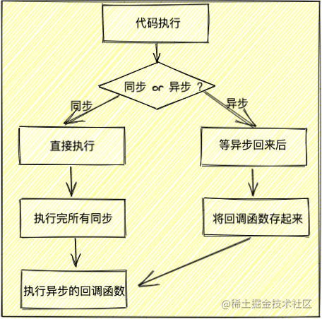
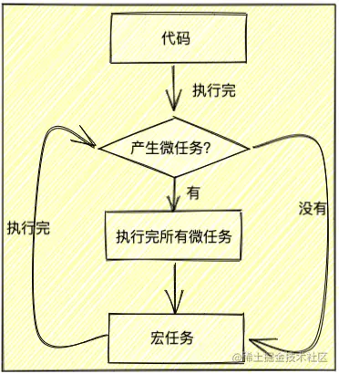

### EventLoop

#### JavaScript 代码执行机制 异步单线程非阻塞

1、遇到同步代码直接执行
2、遇到异步代码先放一边，并且将他回调函数存起来，存的地方叫事件队列
3、等所有同步代码都执行完，再从事件队列中把存起来的所有异步回调函数拿出来按顺序执行

#### 宏任务 && 微任务

##### 宏任务

> 执行宏任务按照任务时间执行，时间相同则按照对列的先后

| #                     | 浏览器 | Node |
| --------------------- | ------ | ---- |
| I/O                   | ✅     | ✅   |
| setTimeout            | ✅     | ✅   |
| setTimeout            | ✅     | ✅   |
| setInterval           | ✅     | ✅   |
| setImmediate          | ❌     | ✅   |
| requestAnimationFrame | ✅     | ❌   |

##### 微任务

> **注意：** 微任务值得是 promise.then catch finally(请求回来的时候) 而不是发请求的出去的时候

| #                                    | 浏览器 | node |
| ------------------------------------ | ------ | ---- |
| Promise.prototype.then catch finally | ✅     | ✅   |
| process.nextTick                     | ❌     | ✅   |
| MutationObserver                     | ❌     | ✅   |

##### 执行流程

