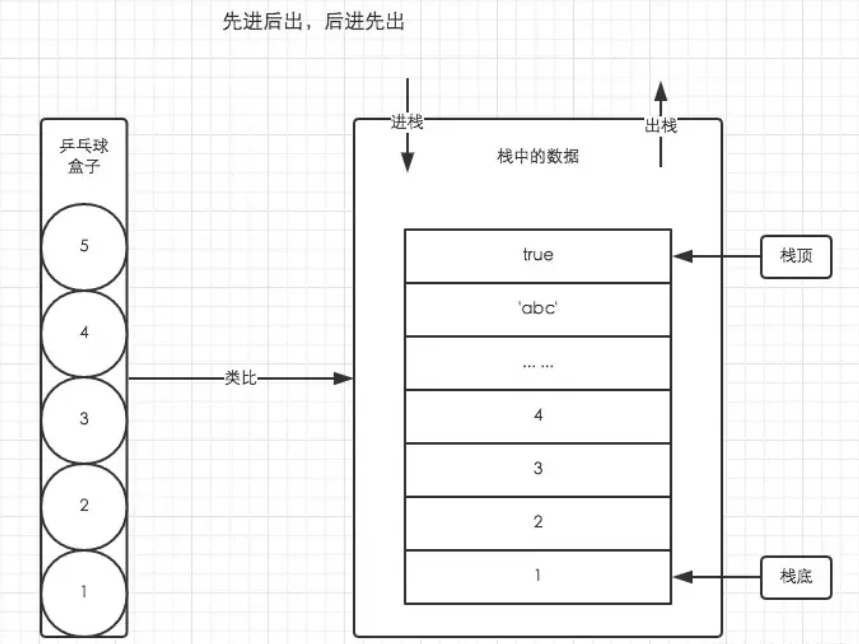
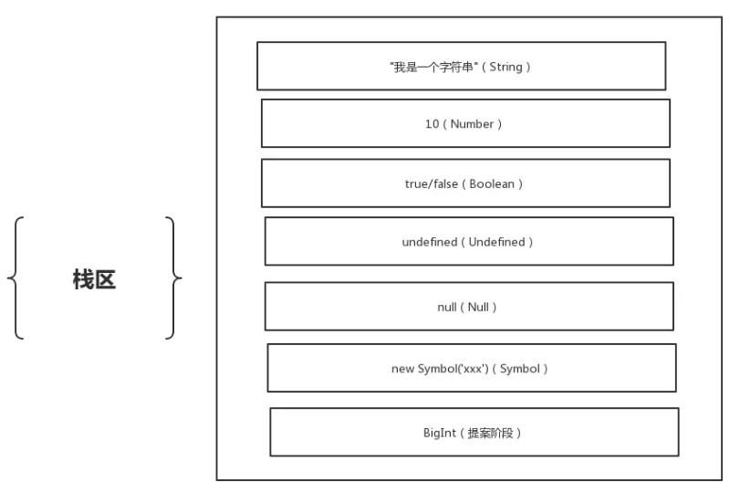
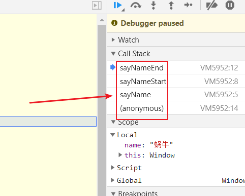
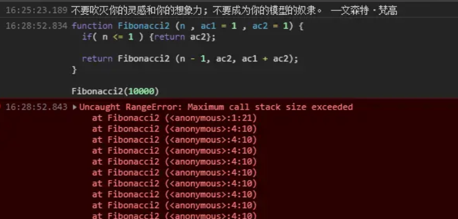
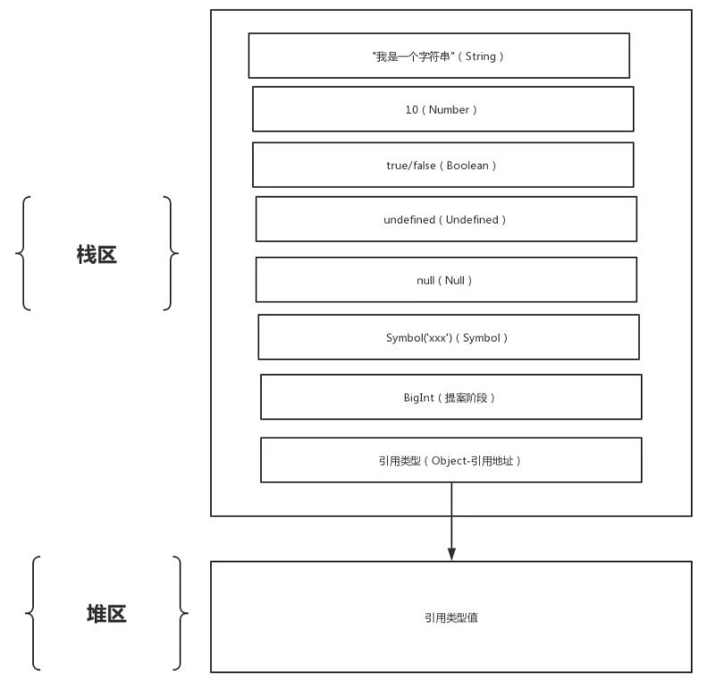
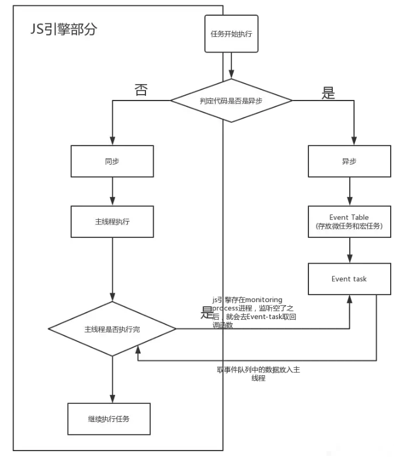

# JavaScript 栈堆

## 栈

栈是限定仅在表尾进行插入和删除操作的线性表，

栈的概念是弹压,就像子弹壳装弹,一粒一粒压进去,但是打出来的时候是从上面打出来的,最先压进去的最后弹出来,如果进去顺序是 123,打出来顺序是 321,这就是后进先出

栈作为一种数据结构，是一种只能在一端进行插入和删除操作的特殊线性表。它按照后进先出的原则存储数据，先进入的数据被压入栈底，最后的数据在栈顶，需要读数据的时候从栈顶开始弹出数据（最后一个数据被第一个读出来）。

栈是允许在同一端进行插入和删除操作的特殊线性表。允许进行插入和删除操作的一端称为栈顶(top)，另一端为栈底(bottom)；栈底固定，而栈顶浮动；栈中元素个数为零时称为空栈。插入一般称为进栈（PUSH），删除则称为退栈（POP），栈也称为后进先出表。



### 基本数据结构的存储（存储栈）

javaScript 中，数据类型分为基本数据类型和引用数据类型，基本数据类型包含：string、number、boolean、undefined、null、symbol、bigint 这几种。在内存中这几种数据类型存储在栈空间，我们按值访问。原型类型都存储在栈内存中，是大小固定并且有序的。



### 执行栈（函数调用栈）

JavaScript 中如何通过栈来管理多个执行上下文

- 程序执行进入一个执行环境时，它的执行上下文就会被创建，并被推入执行栈中(入栈)。
- 程序执行完成时，它的执行上下文就会被销毁，并从栈顶被推出(出栈)，控制权交由下一个执行上下文。

JavaScript 中每一个可执行代码，在解释执行前，都会创建一个可执行上下文。按照可执行代码块可分为三种可执行上下文。

- 全局可执行上下文：每一个程序都有一个全局可执行代码，并且只有一个。任何不在函数内部的代码都在全局执行上下文。
- 函数可执行上下文：每当一个函数被调用时, 都会为该函数创建一个新的上下文。每个函数都被调用时都会创建它自己的执行上下文。
- Eval 可执行上下文：Eval 也有自己执行上下文。

因为 JS 执行中最先进入全局环境，所以处于"栈底的永远是全局环境的执行上下文"。而处于"栈顶的是当前正在执行函数的执行上下文"，当函数调用完成后，它就会从栈顶被推出（理想的情况下，闭包会阻止该操作，闭包后续文章深入详解）。

"全局环境只有一个，对应的全局执行上下文也只有一个，只有当页面被关闭之后它才会从执行栈中被推出，否则一直存在于栈底"

看个例子：

```js
let name = '蜗牛'

function sayName(name) {
	sayNameStart(name)
}
function sayNameStart(name) {
	sayNameEnd(name)
}
function sayNameEnd(name) {
	console.log(name)
	debugger
}
sayName(name)
```

执行 sayName 函数时，会把直接函数压如执行栈，并且会创建执行上下文，执行完毕编译器会自动释放



### 栈溢出问题

#### 栈大小限制

不同浏览器对调用栈的大小是有限制，超过将出现栈溢出的问题。下面这段代码可以检验不用浏览器对调用栈的大小限制。

```js
var i = 0
function recursiveFn() {
	i++
	recursiveFn()
}
try {
	recursiveFn()
} catch (ex) {
	console.log(`我的最大调用栈 i = ${i} errorMsg = ${ex}`)
}
```

#### 递归调用的栈溢出问题

```js
function Fibonacci(n) {
	if (n <= 1) {
		return 1
	}

	return Fibonacci(n - 1) + Fibonacci(n - 2)
}

Fibonacci(10) // 89
Fibonacci(100) // 超时
Fibonacci(500) // 超时
```

上面代码是一个阶乘函数，计算 n 的阶乘，最多需要保存 n 个调用记录，复杂度 O(n) 。如果超出限制，会出现栈溢出问题。

#### [尾递归调用优化](https://es6.ruanyifeng.com/#docs/function#%E5%B0%BE%E8%B0%83%E7%94%A8%E4%BC%98%E5%8C%96)

递归非常耗费内存，因为需要同时保存成千上百个调用帧，很容易发生“栈溢出”错误（stack overflow）。但对于尾递归来说，由于只存在一个调用帧，所以永远不会发生“栈溢出”错误。

```js
function Fibonacci2(n, ac1 = 1, ac2 = 1) {
	if (n <= 1) {
		return ac2
	}

	return Fibonacci2(n - 1, ac2, ac1 + ac2)
}

Fibonacci2(100) // 573147844013817200000
Fibonacci2(1000) // 7.0330367711422765e+208
Fibonacci2(10000) // Infinity
```

由此可见，“尾调用优化”对递归操作意义重大，所以一些函数式编程语言将其写入了语言规格。ES6 亦是如此，第一次明确规定，所有 ECMAScript 的实现，都必须部署“尾调用优化”。这就是说，ES6 中只要使用尾递归，就不会发生栈溢出（或者层层递归造成的超时），相对节省内存。

为什么这个例子里尾递归占用的栈内存也会随着参数增加呢

说好的尾递归优化只存在一个调用帧了，说好的永远不会发生“栈溢出”了。这路给大家解释一下原因。 各大浏览器（除了 safari）根本就没部署尾调用优化，直接在浏览器上的控制台上调试尾递归的代码当然还是会出现栈溢出的问题。

## 堆

堆是向高地址扩展的数据结构，是不连续的内存区域。这是由于系统是用链表来存储的空闲内存地址的，自然是不连续的，而链表的遍历方向是由低地址向高地址。堆的大小受限于计算机系统中有效的虚拟内存。

堆逻辑上可以看成是一堆空间，就像一个抽屉，可以往里面放定西（数据）。
堆，一般由操作人员（程序员）分配释放，若操作人员不分配释放，将由 OS 回收释放。分配方式类似链表。堆存储在二级缓存中。

### 堆内存

JavaScript 的数据类型除了基本类型，还有一类是 Object 类型，它包含 Object、Function、Array、Date、RegExp

Object 类型都存储在堆内存中，是大小不定，复杂可变的。**Object 类型数据的 指针 存储在栈内存空间， 指针实际指向的值存储在堆内存空间**。


## 为什么会有堆内存、栈内存之分

栈像个容器，容量小速度快，由系统自动分配，但程序员是无法控制的。
堆像个房间，容量较大，是由 new 分配的内存，一般速度比较慢，而且容易产生内存碎片,不过用起来最方便

## 队列

队列遵循 FIFO，先进先出原则的一组有序集合。队列在尾部添加元素，在顶部删除元素。在现实中最常见的队列就是排队。先排队的先服务。（请大家文明排队，不要插队。）


### 任务队列

JavaScript 是单线程，单线程任务被分为同步任务和异步任务。同步任务在调用栈中等待主线程依次执行，异步任务会在有了结果之后，将回调函数注册到任务队列，等待主线程空闲（调用栈为空），放入执行栈等待主线程执行。

Event loop 执行如下图，任务队列只是其中的一部分


执行栈在执行完同步任务之后，如果执行栈为空，就会去检查微任务（MicroTask）队列是否为空，如果为空的话，就会去执行宏任务队列（MacroTask）。否则就会一次性执行完所有的微任务队列。
每次一个宏任务执行完成之后，都会去检查微任务队列是否为空，如果不为空就会按照先进先出的方式执行完微任务队列。然后在执行下一个宏任务，如此循环执行。直到结束。
