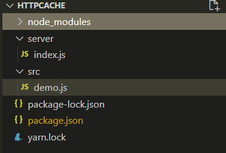
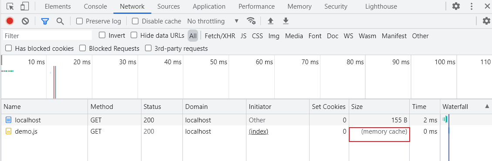
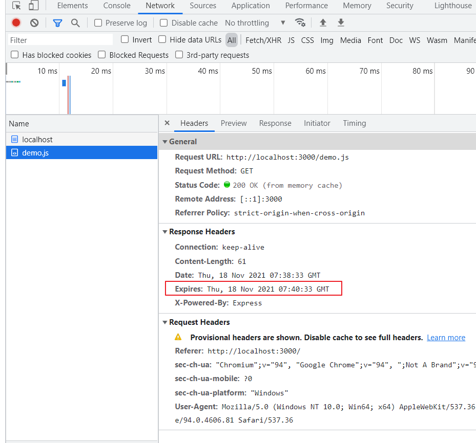
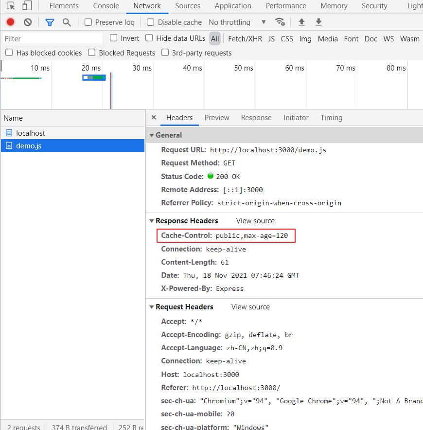
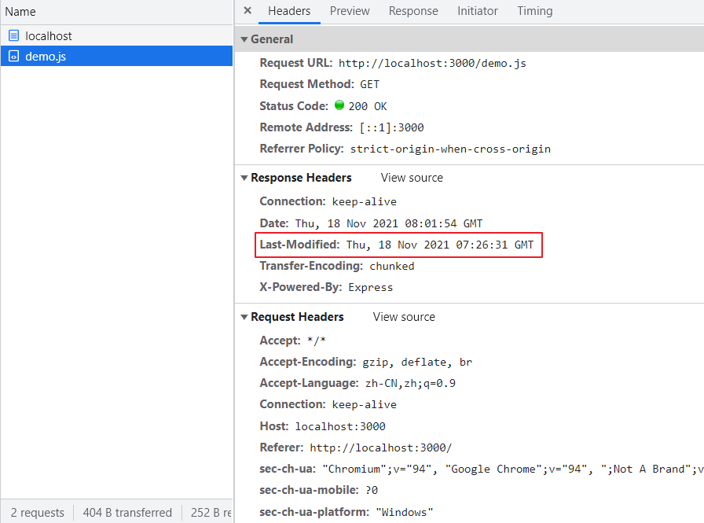
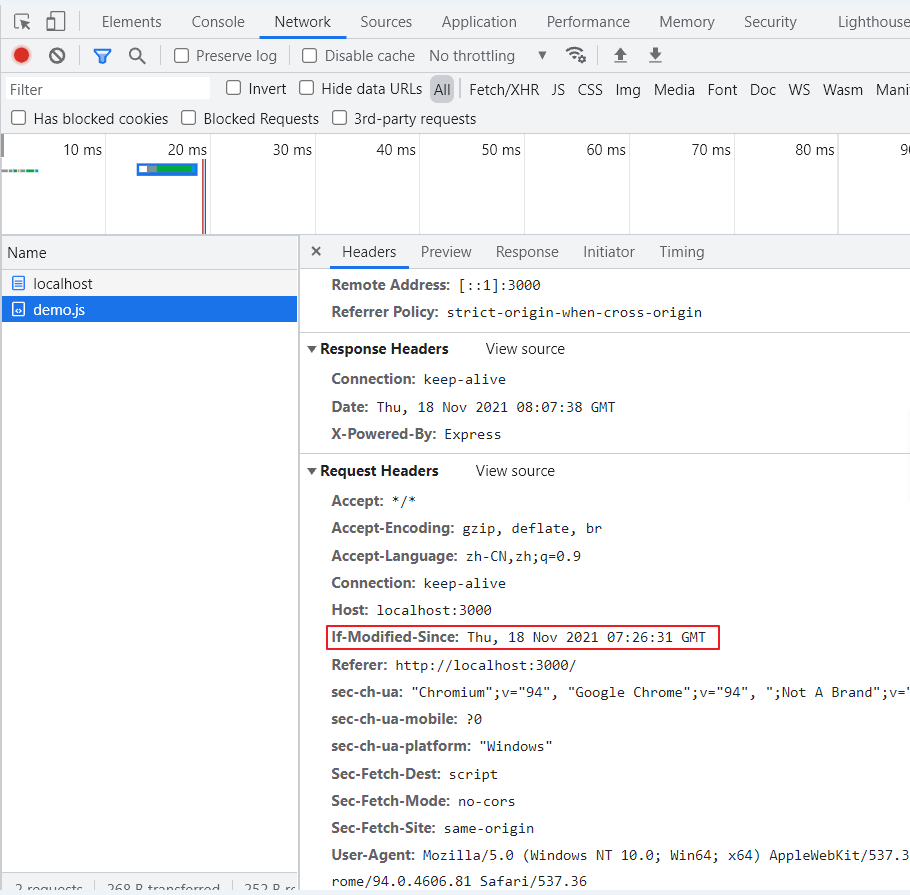
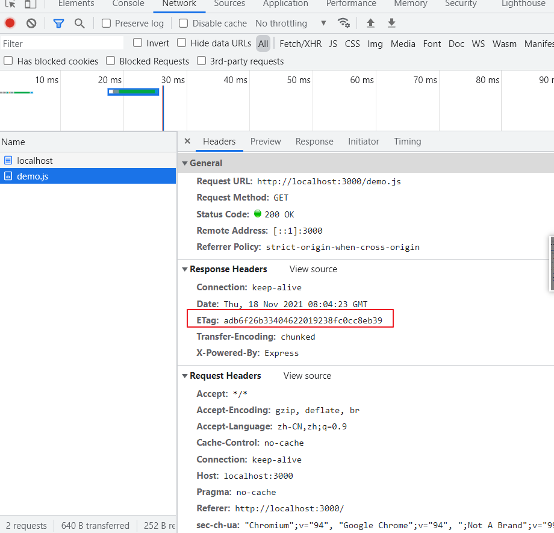
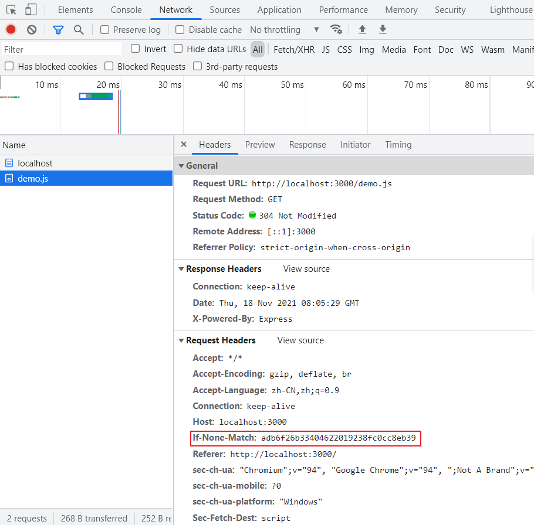

## 浏览器缓存

[参考 稀土掘金 谢小飞](https://juejin.cn/post/6844903655619969038#heading-0)

Http 缓存可以分为两大类，强制缓存（也称强缓存）和协商缓存。两类缓存规则不同，强制缓存在缓存数据未失效的情况下，不需要再和服务器发生交互；而协商缓存，顾名思义，需要进行比较判断是否可以使用缓存。
   两类缓存规则可以同时存在，强制缓存优先级高于协商缓存，也就是说，当执行强制缓存的规则时，如果缓存生效，直接使用缓存，不再执行协商缓存规则。

## Http 简介

浏览器和服务器之间通信是通过 HTTP 协议，HTTP 协议永远都是客户端发起请求，服务器回送响应。模型如下：


HTTP 报文就是浏览器和服务器间通信时发送及响应的数据块。浏览器向服务器请求数据，发送请求(request)报文；服务器向浏览器返回数据，返回响应(response)报文。报文信息主要分为两部分：

- 报文头部：一些附加信息（cookie，缓存信息等），与缓存相关的规则信息，均包含在头部中
- 数据主体部分：HTTP 请求真正想要传输的数据内容

本文用到的一些报文头如下：
|字段名称|字段所属|
|---|---|
|Pragma|通用头|
|Expires|响应头|
|Cache-Control |通用头|
|Last-Modified|响应头|
|If-Modified-Sice|请求头|
| ETag|响应头|
|If-None-Match|请求头|

## 准备工作

本地搭建一个 express 服务 目录如下



```js
//demo.js
console.log('demo')
console.log(3333)
console.log(321321)
```

```js
// index.jd
const express = require('express')
const app = express()
const port = 3000
const fs = require('fs')
const path = require('path')
const moment = require('moment')
const md5 = require('md5')

app.get('/', (req, res) => {
	res.send(`<!DOCTYPE html>
    <html lang="en">
    <head>
        <title>Document</title>
    </head>
    <body>
        Http Cache Demo
        <script src="/demo.js"></script>
    </body>
    </html>`)
})
let time = 0
app.get('/demo.js', (req, res) => {
	let jsPath = path.resolve(__dirname, '../src/demo.js')
	let cont = fs.readFileSync(jsPath)
	time = time + 1
	console.log('---------------', `请求第${time}次`)
	res.end(cont)
})

app.listen(port, () => {
	console.log(`listen on ${port}`)
})
```

浏览器输入`http://localhost:3000/` 请求 demo.js 过程如下：

- 浏览器发起请求静态资源 demo.js
- 服务器读取磁盘文件 demo.js，返给浏览器
- 浏览器再次请求，服务器又重新读取磁盘文件 a.js，返给浏览器。
- 循环请求。。
  看得出来这种请求方式的流量与请求次数有关，同时，缺点也很明显：

- 浪费用户流量
- 浪费服务器资源，服务器要读磁盘文件，然后发送文件到浏览器
- 浏览器要等待 js 下载并且执行后才能渲染页面，影响用户体验

## Http 缓存的分类

Http 缓存可以分为两大类，强制缓存（也称强缓存）和协商缓存。两类缓存规则不同，强制缓存在缓存数据未失效的情况下，不需要再和服务器发生交互；而协商缓存，顾名思义，需要进行比较判断是否可以使用缓存。

两类缓存规则可以同时存在，强制缓存优先级高于协商缓存，也就是说，当执行强制缓存的规则时，如果缓存生效，直接使用缓存，不再执行协商缓存规则。

### 强制缓存

强制缓存分为两种情况，Expires 和 Cache-Control

#### Expires

Expires 的值是服务器告诉浏览器的缓存过期时间（值为 GMT 时间，即格林尼治时间），即下一次请求时，如果浏览器端的当前时间还没有到达过期时间，则直接使用缓存数据。下面通过我们的 Express 服务器来设置一下 Expires 响应头信息

```js
//其他代码...
const moment = require('moment')

app.get('/demo.js', (req, res) => {
	let jsPath = path.resolve(__dirname, '../src/demo.js')
	let cont = fs.readFileSync(jsPath)
	res.setHeader('Expires', getGLNZ()) //2分钟
	res.end(cont)
})

function getGLNZ() {
	return moment().utc().add(2, 'm').format('ddd, DD MMM YYYY HH:mm:ss') + ' GMT'
}
//其他代码...
```

我们在 demo.js 中添加了一个 Expires 响应头，不过由于是格林尼治时间，所以通过 momentjs 转换一下。第一次请求的时候还是会向服务器发起请求，同时会把过期时间和文件一起返回给我们；但是当我们刷新的时候，才是见证奇迹的时刻：



可以看出文件是直接从缓存（memory cache）中读取的，并没有发起请求。我们在这边设置过期时间为两分钟，两分钟过后可以刷新一下页面看到浏览器再次发送请求了

虽然这种方式添加了缓存控制，节省流量，但是还是有以下几个问题的：

- 由于浏览器时间和服务器时间不同步，如果浏览器设置了一个很后的时间，过期时间一直没有用
- 缓存过期后，不管文件有没有发生变化，服务器都会再次读取文件返回给浏览器

> 不过 Expires 是 HTTP 1.0 的东西，现在默认浏览器均默认使用 HTTP 1.1，所以它的作用基本忽略。

#### Cache-Control

针对浏览器和服务器时间不同步，加入了新的缓存方案；这次服务器不是直接告诉浏览器过期时间，而是告诉一个相对时间 Cache-Control=10 秒，意思是 10 秒内，直接使用浏览器缓存。

```js
app.get('/demo.js', (req, res) => {
	let jsPath = path.resolve(__dirname, '../src/demo.js')
	let cont = fs.readFileSync(jsPath)
	res.setHeader('Cache-Control', 'public,max-age=120') //2分钟
	res.end(cont)
})
```

在这 120 内请求 demo.js 都是缓存



### 协商缓存

强制缓存的弊端很明显，即每次都是根据时间来判断缓存是否过期；但是当到达过期时间后，如果文件没有改动，再次去获取文件就有点浪费服务器的资源了。协商缓存有两组报文结合使用：

- Last-Modified 和 If-Modified-Since
- ETag 和 If-None-Match

#### Last-Modified

为了节省服务器的资源，再次改进方案。浏览器和服务器协商，服务器每次返回文件的同时，告诉浏览器文件在服务器上最近的修改时间。请求过程如下：

- 浏览器请求静态资源 demo.js
- 服务器读取磁盘文件 demo.js，返给浏览器，同时带上文件上次修改时间 Last-Modified（GMT 标准格式）
- 当浏览器上的缓存文件过期时，浏览器带上请求头 If-Modified-Since（等于上一次请求的 Last-Modified）请求服务器
- 服务器比较请求头里的 If-Modified-Since 和文件的上次修改时间。如果果一致就继续使用本地缓存（304），如果不一致就再次返回文件内容和 Last-Modified。
- 循环请求。。

  > a.浏览器第一次请求一个资源，服务器返回了该资源时，会在 response headers 中加上 Last-Modified，这个 response headers 表示这个资源在服务器上的最后一次修改时间；
  > b.当浏览器再次请求该资源时，会在 request headers 中加上 If-Modified-Since，这个值即为上一次服务器返回的 Last-Modified 时间；服务器再次收到资源请求时，将 If-Modified-Since 时间和资源在服务器上的最后修改时间与对比，如果 If-Modifid-Since 与最后修改时间一致，则命中缓存，服务器返回 304，浏览器从缓存中获取资源；
  > c.若未命中缓存，服务器返回资源同时，浏览器缓存资源的 Last-Modified 会被更新。

代码实现过程如下：console.log(111)
第一次请求之后再刷新发现都是 304 因为文件没有改动，如果改动 demo.js 比如添加一段新的`console.log(111)` 再次请求就会发现不是 304 而是 200

```js
app.get('/demo.js', (req, res) => {
	let jsPath = path.resolve(__dirname, '../src/demo.js')
	let cont = fs.readFileSync(jsPath)
	let status = fs.statSync(jsPath)
	time = time + 1
	let lastModified = status.mtime.toUTCString()
	console.log('---------------', `请求第${time}次`)
	console.log('lastModified', lastModified)
	console.log('if-modified-since', req.headers['if-modified-since'])
	console.log('---', lastModified === req.headers['if-modified-since'])
	if (lastModified === req.headers['if-modified-since']) {
		res.writeHead(304, 'Not Modified')
		res.end()
	} else {
		res.setHeader('Last-Modified', lastModified)
		res.writeHead(200, 'OK')
		res.end(cont)
	}
})
```





虽然这个方案比前面三个方案有了进一步的优化，**浏览器检测文件是否有修改**，如果没有变化就不再发送文件；但是还是有以下缺点：

- 由于 Last-Modified 修改时间是 GMT 时间，只能精确到秒，如果文件在 1 秒内有多次改动，服务器并不知道文件有改动，浏览器拿不到最新的文件
- 如果服务器上文件被多次修改了但是内容却没有发生改变，服务器需要再次重新返回文件

#### ETag

为了解决文件修改时间不精确带来的问题，服务器和浏览器再次协商，这次不返回时间，返回文件的唯一标识 ETag。只有当文件内容改变时，ETag 才改变。请求过程如下：

- 浏览器请求静态资源 demo.js
- 服务器读取磁盘文件 demo.js，返给浏览器，同时带上文件的唯一标识 ETag
- 当浏览器上的缓存文件过期时，浏览器带上请求头 If-None-Match（等于上一次请求的 ETag）请求服务器
- 服务器比较请求头里的 If-None-Match 和文件的 ETag。如果一致就继续使用本地缓存（304），如果不一致就再次返回文件内容和 ETag。
- 循环请求。。

```js
app.get('/demo.js', (req, res) => {
	let jsPath = path.resolve(__dirname, '../src/demo.js')
	let cont = fs.readFileSync(jsPath)
	time = time + 1
	console.log('---------------', `请求第${time}次`)
	let etag = md5(cont)
	console.log('是否相等', req.headers['if-none-match'] === etag)
	if (req.headers['if-none-match'] === etag) {
		res.writeHead(304, 'Not Modified')
		res.end()
	} else {
		res.setHeader('ETag', etag)
		res.writeHead(200, 'OK')
		res.end(cont)
	}
})
```





### 一些额外的东西

在报文头的表格中我们可以看到有一个字段叫 Pragma，这是一段尘封的历史....

在“遥远的”http1.0 时代，给客户端设定缓存方式可通过两个字段--Pragma 和 Expires。虽然这两个字段早可抛弃，但为了做 http 协议的向下兼容，你还是可以看到很多网站依旧会带上这两个字段。

#### 关于 Pragma

当该字段值为 no-cache 的时候，会告诉浏览器不要对该资源缓存，即每次都得向服务器发一次请求才行。

```js
res.setHeader('Pragma', 'no-cache') //禁止缓存
res.setHeader('Cache-Control', 'public,max-age=120') //2分钟
```

通过 Pragma 来禁止缓存，通过 Cache-Control 设置两分钟缓存，但是重新访问我们会发现浏览器会再次发起一次请求，说明了 Pragma 的优先级高于 Cache-Control

#### 关于 Cache-Control

我们看到 Cache-Control 中有一个属性是 public，那么这代表了什么意思呢？其实 Cache-Control 不光有 max-age，它常见的取值 private、public、no-cache、max-age，no-store，默认值为 private，各个取值的含义如下：

- private: 客户端可以缓存
- public: 客户端和代理服务器都可缓存
- max-age=xxx: 缓存的内容将在 xxx 秒后失效
- no-cache: 需要使用对比缓存来验证缓存数据
- no-store: 所有内容都不会缓存，强制缓存，对比缓存都不会触发

所以我们在刷新页面的时候，如果只按 F5 只是单纯的发送请求，按 Ctrl+F5 会发现请求头上多了两个字段 Pragma: no-cache 和 Cache-Control: no-cache。

#### 缓存的优先级

上面我们说过强制缓存的优先级高于协商缓存，Pragma 的优先级高于 Cache-Control，那么其他缓存的优先级顺序怎么样呢？网上查阅了资料得出以下顺序（PS：有兴趣的童鞋可以验证一下正确性告诉我）：

```txt
Pragma > Cache-Control > Expires > ETag > Last-Modified
```
