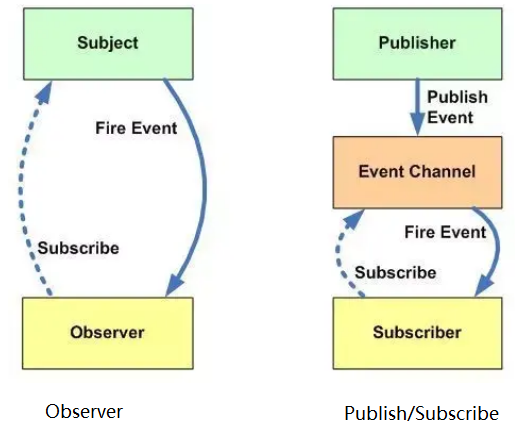

# JavaScript 设计模式之发布订阅模式

## 定义

发布-订阅模式其实是一种对象间一对多的依赖关系，当一个对象的状态发送改变时，所有依赖于它的对象都将得到状态改变的通知。
订阅者（Subscriber）把自己想订阅的事件注册（Subscribe）到调度中心（Event Channel），当发布者（Publisher）发布该事件（Publish Event）到调度中心，也就是该事件触发时，由调度中心统一调度（Fire Event）订阅者注册到调度中心的处理代码。

### 例子

比如我们很喜欢看某个公众号号的文章，但是我们不知道什么时候发布新文章，要不定时的去翻阅；这时候，我们可以关注该公众号，当有文章推送时，会有消息及时通知我们文章更新了。
上面一个看似简单的操作，其实是一个典型的发布订阅模式，公众号属于发布者，用户属于订阅者；用户将订阅公众号的事件注册到调度中心，公众号作为发布者，当有新文章发布时，公众号发布该事件到调度中心，调度中心会及时发消息告知用户。

## 实现发布订阅模式的事件处理中心

### 实现思路

- 创建一个 EventEmitter 类
- 在该类上创建一个事件中心（Map）
- on 方法用来把函数 fn 都加到事件中心中（订阅者注册事件到调度中心）
- emit 方法取到 arguments 里第一个当做 event，根据 event 值去执行对应事件中心中的函数（发布者发布事件到调度中心，调度中心处理代码）
- off 方法可以根据 event 值取消订阅（取消订阅）
- once 方法只监听一次，调用完毕后删除缓存函数（订阅一次）
- 注册一个 newListener 用于监听新的事件订阅

### 第一步，创建一个类，并初始化一个事件存储中心

```js
class EventEmitter {
	// 用来存放注册的事件与回调
	constructor() {
		this._events = {}
	}
}
```

### 第二步，实现事件的订阅方法 on

将事件回调函数存储到对应的事件上

```js
class EventEmitter {
	// 用来存放注册的事件与回调
	constructor() {
		this._events = {}
	}

	on(eventName, callback) {
		// 由于一个事件可能注册多个回调函数，所以使用数组来存储事件队列
		const callbacks = this._events[eventName] || []
		callbacks.push(callback)
		this._events[eventName] = callbacks
	}
}
```

### 第三步，实现事件的发布方法 emit

获取到事件对应的回调函数依次执行

```js
class EventEmitter {
	// 用来存放注册的事件与回调
	constructor() {
		this._events = {}
	}

	// args 用于收集发布事件时传递的参数
	emit(eventName, ...args) {
		const callbacks = this._events[eventName] || []
		callbacks.forEach(cb => cb(...args))
	}
}
```

### 第四步，实现事件的取消订阅方法 off

找到事件对应的回调函数，删除对应的回调函数

```js
class EventEmitter {
	// 用来存放注册的事件与回调
	constructor() {
		this._events = {}
	}

	off(eventName, callback) {
		const callbacks = this._events[eventName] || []

		const newCallbacks = callbacks.filter(fn => fn != callback && fn.initialCallback != callback /* 用于once的取消订阅 */)

		this._events[eventName] = newCallbacks
	}
}
```

### 第五步，实现事件的单次订阅方法 once

1.先注册 2.事件执行后取消订阅

```js
class EventEmitter {
	// 用来存放注册的事件与回调
	constructor() {
		this._events = {}
	}

	//
	once(eventName, callback) {
		// 由于需要在回调函数执行后，取消订阅当前事件，所以需要对传入的回调函数做一层包装,然后绑定包装后的函数
		const one = (...args) => {
			// 执行回调函数
			callback(...args)
			// 取消订阅当前事件
			this.off(eventName, one)
		}
		// 考虑：如果当前事件在未执行，被用户取消订阅，能否取消？

		// 由于：我们订阅事件的时候，修改了原回调函数的引用，所以，用户触发 off 的时候不能找到对应的回调函数
		// 所以，我们需要在当前函数与用户传入的回调函数做一个绑定，我们通过自定义属性来实现
		one.initialCallback = callback
		this.on(eventName, one)
	}
}
```

### 第六步，注册一个 newListener 用于监听新的事件订阅

在用户注册的事件的时候，发布一下 newListener 事件

```js
class EventEmitter {
	// 用来存放注册的事件与回调
	constructor() {
		this._events = {}
	}

	on(eventName, callback) {
		// 如果绑定的事件不是newListener 就触发改回调
		if (eventName !== 'newListener') {
			this.emit('newListener', eventName)
		}
		// 由于一个事件可能注册多个回调函数，所以使用数组来存储事件队列
		const callbacks = this._events[eventName] || []
		callbacks.push(callback)
		this._events[eventName] = callbacks
	}
}
```

### 完整代码

```js
class EventEmitter {
	constructor() {
		this._events = {}
	}

	on(eventName, callback) {
		if (this.eventName !== 'newListener') {
			this.emit('newListener', eventName)
		}
		const callbacks = this._events[eventName] || []
		callbacks.push(callback)
		this._events[eventName] = callbacks
	}

	emit(eventName, ...args) {
		const callbacks = this._events[eventName] || []
		callbacks.forEach(cb => cb(...args))
	}

	once(eventName, callback) {
		const one = (...args) => {
			callback(...args)
			this.off(eventName, one)
		}
		one.initialCallback = callback
		this.on(eventName, one)
	}

	off(eventName, callback) {
		const callbacks = this._events[eventName] || []
		const newCallbacks = callbacks.filter(fn => fn != callback && fn.initialCallback != callback /* 用于once的取消订阅 */)
		this._events[eventName] = newCallbacks
	}
}

const events = new EventEmitter()

events.on('newListener', function (eventName) {
	console.log(`eventName`, eventName)
})

events.on('hello', function () {
	console.log('hello')
})

let cb = function () {
	console.log('cb')
}
events.on('hello', cb)

events.off('hello', cb)

function once() {
	console.log('once')
}
events.once('hello', once)

events.off('hello', once)
events.emit('hello')
events.emit('hello')
```

## Vue 中的实现发布订阅者模式

有了发布-订阅模式的知识后，我们来看下 Vue 中怎么实现 $on 和 $emit 的方法，直接看源码：

```js
function eventsMixin(Vue) {
	var hookRE = /^hook:/
	Vue.prototype.$on = function (event, fn) {
		var this$1 = this

		var vm = this
		// event 为数组时，循环执行 $on
		if (Array.isArray(event)) {
			for (var i = 0, l = event.length; i < l; i++) {
				this$1.$on(event[i], fn)
			}
		} else {
			;(vm._events[event] || (vm._events[event] = [])).push(fn)
			// optimize hook:event cost by using a boolean flag marked at registration
			// instead of a hash lookup
			if (hookRE.test(event)) {
				vm._hasHookEvent = true
			}
		}
		return vm
	}

	Vue.prototype.$once = function (event, fn) {
		var vm = this
		// 先绑定，后删除
		function on() {
			vm.$off(event, on)
			fn.apply(vm, arguments)
		}
		on.fn = fn
		vm.$on(event, on)
		return vm
	}

	Vue.prototype.$off = function (event, fn) {
		var this$1 = this

		var vm = this
		// all，若没有传参数，清空所有订阅
		if (!arguments.length) {
			vm._events = Object.create(null)
			return vm
		}
		// array of events，events 为数组时，循环执行 $off
		if (Array.isArray(event)) {
			for (var i = 0, l = event.length; i < l; i++) {
				this$1.$off(event[i], fn)
			}
			return vm
		}
		// specific event
		var cbs = vm._events[event]
		if (!cbs) {
			// 没有 cbs 直接 return this
			return vm
		}
		if (!fn) {
			// 若没有 handler，清空 event 对应的缓存列表
			vm._events[event] = null
			return vm
		}
		if (fn) {
			// specific handler，删除相应的 handler
			var cb
			var i$1 = cbs.length
			while (i$1--) {
				cb = cbs[i$1]
				if (cb === fn || cb.fn === fn) {
					cbs.splice(i$1, 1)
					break
				}
			}
		}
		return vm
	}

	Vue.prototype.$emit = function (event) {
		var vm = this
		{
			// 传入的 event 区分大小写，若不一致，有提示
			var lowerCaseEvent = event.toLowerCase()
			if (lowerCaseEvent !== event && vm._events[lowerCaseEvent]) {
				tip(
					'Event "' +
						lowerCaseEvent +
						'" is emitted in component ' +
						formatComponentName(vm) +
						' but the handler is registered for "' +
						event +
						'". ' +
						'Note that HTML attributes are case-insensitive and you cannot use ' +
						'v-on to listen to camelCase events when using in-DOM templates. ' +
						'You should probably use "' +
						hyphenate(event) +
						'" instead of "' +
						event +
						'".'
				)
			}
		}
		var cbs = vm._events[event]
		if (cbs) {
			cbs = cbs.length > 1 ? toArray(cbs) : cbs
			// 只取回调函数，不取 event
			var args = toArray(arguments, 1)
			for (var i = 0, l = cbs.length; i < l; i++) {
				try {
					cbs[i].apply(vm, args)
				} catch (e) {
					handleError(e, vm, 'event handler for "' + event + '"')
				}
			}
		}
		return vm
	}
}

/***
 * Convert an Array-like object to a real Array.
 */
function toArray(list, start) {
	start = start || 0
	var i = list.length - start
	var ret = new Array(i)
	while (i--) {
		ret[i] = list[i + start]
	}
	return ret
}
```

## 总结

### 优点

- 对象之间解耦
- 异步编程中，可以更松耦合的代码编写

### 缺点

- 创建订阅者本身要消耗一定的时间和内存
- 虽然可以弱化对象之间的联系，多个发布者和订阅者嵌套一起的时候，程序难以跟踪维护

### 扩展（发布-订阅模式与观察者模式的区别）

很多地方都说发布-订阅模式是观察者模式的别名，但是他们真的一样吗？是不一样的。


观察者模式：观察者（Observer）直接订阅（Subscribe）主题（Subject），而当主题被激活的时候，会触发（Fire Event）观察者里的事件。

发布订阅模式：订阅者（Subscriber）把自己想订阅的事件注册（Subscribe）到调度中心（Event Channel），当发布者（Publisher）发布该事件（Publish Event）到调度中心，也就是该事件触发时，由调度中心统一调度（Fire Event）订阅者注册到调度中心的处理代码。
