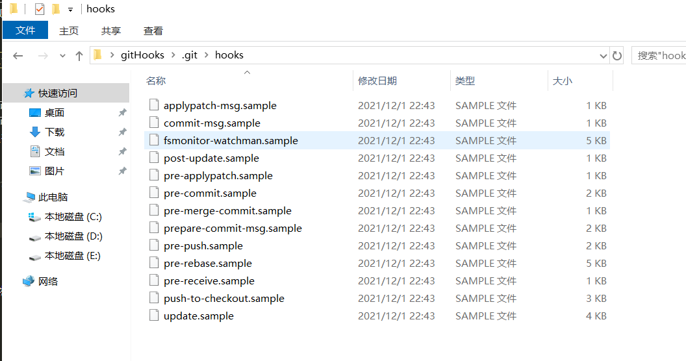
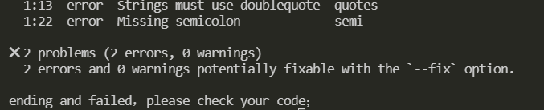
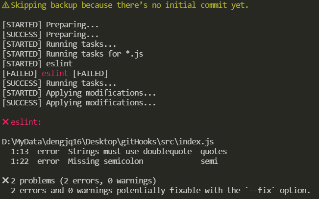
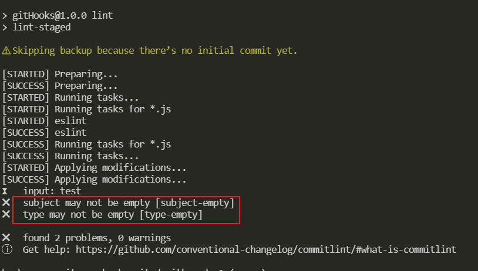
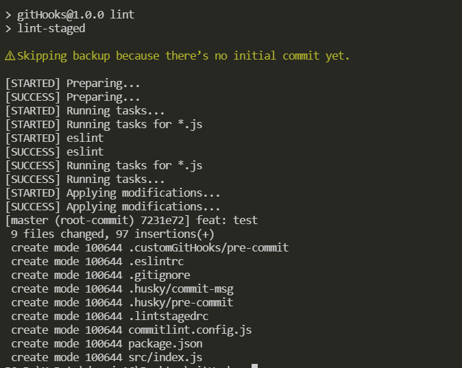
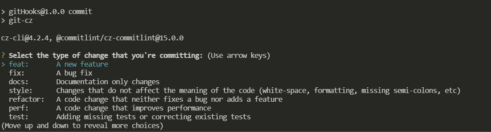
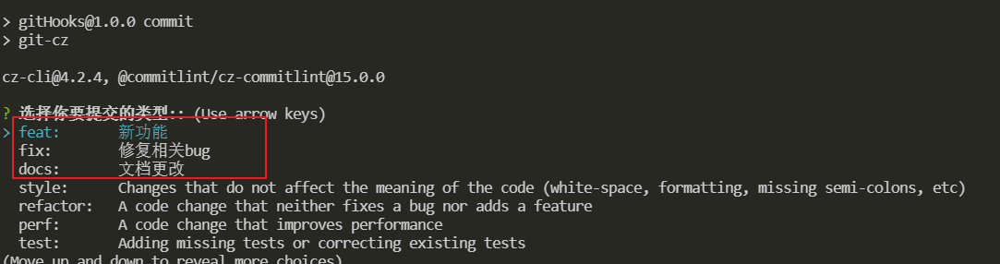

# 使用 gitHooks 提交前校验代码

在每一个使用 git 进行版本管理的仓库，都有一个目录 .git/hooks，包含 commit 各个阶段 [Hooks](https://git-scm.com/book/zh/v2/%E8%87%AA%E5%AE%9A%E4%B9%89-Git-Git-%E9%92%A9%E5%AD%90) 的脚本。这些 Hooks 在 git 操作 commit、push、merge 等得时候，可以做前置或者后置的操作，例如 pre-commit 在 git commit 前可以做代码校验，校验代码的时候使用的[ESLint](https://eslint.bootcss.com/)，格式化使用的是 prettier。Git 支持的常用钩子见下表，更多请查看官网[Hooks](https://git-scm.com/book/zh/v2/%E8%87%AA%E5%AE%9A%E4%B9%89-Git-Git-%E9%92%A9%E5%AD%90):
|Git Hook|调用时机|调用时机|
|---|----|----|
|pre-commit|git commit 执行前|可以用 git commit --no-verify 绕过|
|commit-msg|git commit 执行前|可以用 git commit --no-verify 绕过|
|pre-merge-commit|git merge 执行前|可以用 git merge --no-verify 绕过|
|pre-push|git push 执行前||

> 本文先实践，怎么去写 pre-commit 这个 git hooks，然后介绍 husky，lint-staged，commitlint 的使用

在 git 项目中，`.git/hooks`下面有很多 hooks 示例如下


这些 git hooks 都是`.sample`结尾的，如果要启某个 hooks 用可以去掉`.sample`结尾

## 实践

` npm init -y`初始化一个项目，然后`git init`，然后`npm install eslint --save-dev`

新建`.gitignore`文件

```
node_modules

# local env files
.env.local
.env.*.local

# Log files
npm-debug.log*
yarn-debug.log*
yarn-error.log*

*-lock.json
*.lock
```

新建`.eslintrc`，配置 eslint

```json
{
	"rules": {
		// 要求使用分号
		"semi": ["error", "always"],
		// 强制使用一致的反勾号、双引号或单引号
		"quotes": ["error", "double"]
	}
}
```

新建`src`目录，然后里面新建`index.js`，禁止使用快捷键格式化

```js
console.log('object')
```

根目录新建文件夹`.customGitHooks`
然后 `git config 'core.hooksPath' .customGitHooks`，主要是设置 gitHooks 的存放目录，因为 gitHooks 默认存放目录是`.git/hooks`，新建`pre-commit`，写入如下

```bash
#!/bin/sh

echo 'start check your code，please wait...'
# git diff 获取更改的内容 可以通过参数--diff-filter 配置条件
npx eslint $(git diff --cached --name-only --diff-filter=ACM -- '*.js')
# 变量$?--->上一个命令的执行状态结果
if [ $? != '0' ];then
  echo "ending and failed，please check your code；"
	exit 1
else
  echo "check pass"
fi

```

这时候，执行`git add .`，`git commit -m 'test'`就会发现没有 commit 成功，报错了，如下图

如果把 index.js 的代码修改如下：

```js
console.log('object')
```

执行`git add .` ，`git commit -m 'test'`就会发现 eslint 代码检查通过了，能正常提交了，以上实践能很好解释 commit 前怎么检验代码，但是有个缺点就是别人 pull 你的代码要执行`git config 'core.hooksPath' .customGitHooks`能起作用；下面就介绍 husky，lint-staged，commitlint 的使用

> .git 文件夹不会被跟踪并且上传至远程仓库的

## [Husky](https://typicode.github.io/husky/#/)

[github](https://github.com/typicode/husky)
为了解决`.git`配置不能提交远程仓库的问题，`husky` 出来了，husky 在你`npm i`安装完依赖只有自动执行`husky install`

### 安装 npm install husky -D

```bash
npm install husky -D
```

### 使用

编辑`package.json`在`script`里添加`prepare`的值为`husky install`

```json
  "scripts": {
    "prepare":"husky install"
  },
```

然后执行`npm run prepare`，做了什么事呢

源码`index.ts`中,我们看到执行 husky install 实际上就是创建 `.husky` 目录，复制`../husky.sh`文件到该目录下，配置了一个`.gitignore`,设置了`core.hooksPath`（设置 .husky 目录为 git hooks 目录）

### 添加一个 hook

在`.husky`目录下创建`pre-commit`

```bash
#!/bin/sh

echo 'start check your code，please wait...'
# git diff 获取更改的内容 可以通过参数--diff-filter 配置条件
npx eslint $(git diff --cached --name-only --diff-filter=ACM -- '*.js')
# 变量$?--->上一个命令的执行状态结果
if [ $? != '0' ];then
  echo "ending and failed，please check your code；"
	exit 1
else
  echo "check pass"
fi

```

`index.js`文件内容如下

```js
console.log('object')
```

然后执行`git add .`，`git commit -m 'test'`发现代码已经被拦截，没有提交，因为`index.js`代码不符合规范

> 遗留问题就是 git hooks 不会编写怎么办，下面 lint-staged 出来了

## [lint-staged](https://github.com/okonet/lint-staged)

[配置例子](https://github.com/okonet/lint-staged#examples)
作用：对 Git 暂存区代码文件进行 bash 命令操作等等

```bash
npm i lint-staged -D
```

根目录下新建`.lintstagedrc`文件

```bash
{
  "*.js": "eslint"
}
```

把`husky`目录下的`pre-commit`修改如下

```bash
. "$(dirname "$0")/_/husky.sh"
npm run lint
```

`package.json`添加`script`

```json
"scripts": {
  "lint": "lint-staged"
}
```

`index.js`如下

```js
console.log('object')
console.log('object')
```

执行`git add .`，`git commit -m 'test'`，可以发现调用了 eslint 去检查代码，检查不通过就退出`commit`


综上，代码检测规范有了，现在也需要规范一下提交规范；

## [commitlint](https://github.com/conventional-changelog/commitlint)

[github](https://commitlint.js.org/#/guides-local-setup)

**校验 commit 提交的信息**

`npm install --save-dev @commitlint/config-conventional @commitlint/cli`

使用新建`commitlint.config.js`

```js
module.exports = {
	extends: ['@commitlint/config-conventional'],
	rules: {
		'type-enum': [2, 'always', ['build', 'ci', 'docs', 'feat', 'fix', 'perf', 'refactor', 'style', 'test', 'revert', 'chore']],
		'type-case': [0],
		'type-empty': [0],
		'scope-empty': [0],
		'scope-case': [0],
		'subject-full-stop': [0, 'never'],
		'subject-case': [0, 'never'],
		'header-max-length': [0, 'always', 72]
	}
}
```

配置`git hooks`，执行下面命令

```bash
npx husky add .husky/commit-msg 'npx --no -- commitlint --edit $1'
```

commit message 一般分为三个部分 Header，Body 和 Footer

```bash
header
<type>(<scope>): <subject>
// 空一行
<body>
// 空一行
<footer>
其中，Header 是必需的，Body 和 Footer 可以省略
```

接下来提交的 commit 必须符合下面的格式

> 注意冒号后面有空格

```txt
git commit -m <type>[optional scope]: <description>
```

常用的 type 类别

- build：主要目的是修改项目构建系统(例如 glup，webpack，rollup 的配置等)的提交
- ci：主要目的是修改项目继续集成流程(例如 Travis，Jenkins，GitLab CI，Circle 等)的提交
- docs：文档更新
- feat：新增功能
- fix：bug 修复
- perf：性能优化
- refactor：重构代码(既没有新增功能，也没有修复 bug)
- style：不影响程序逻辑的代码修改(修改空白字符，补全缺失的分号等)
- test：新增测试用例或是更新现有测试
- revert：回滚某个更早之前的提交
- chore：不属于以上类型的其他类型(日常事务)

optional scope：一个可选的修改范围。用于标识此次提交主要涉及到代码中哪个模块。

description：一句话描述此次提交的主要内容，做到言简意赅。

这时候，执行一次测试一下

```bash
git add .
git commit -m 'test'
```

因为该提交的 commit 是不规范的所以提交时失败的 如下图



如果把 commit 修改，就会提交成功，因为符合 commit 规范

```bash
git add .
git commit -m 'feat: test'
```



但是问题又来了，每次 commit 都要输入，有点不方便；而且有可能输错
下面就介绍到 commitizen

## [commitizen](https://github.com/commitizen/cz-cli)

[cz-commitlint](https://github.com/conventional-changelog/commitlint/tree/master/@commitlint/cz-commitlint)

**生成符合规范的 commit message**

本地安装并没有全局安装，当然可以全局安装具体查看[官方文档](https://github.com/commitizen/cz-cli)，全局安装可以使用`git cz`，
`cz-commitlint`打通 `commitizen` 和[`commitlint`](https://github.com/conventional-changelog/commitlint/tree/master/@commitlint/cz-commitlint)配置

```bash
npm install --save-dev @commitlint/cz-commitlint commitizen
```

然后

```bash
npx commitizen init cz-conventional-changelog --save-dev --save-exact
```

`package.json`添加`script`

```json
{
	"scripts": {
		"commit": "git-cz"
	},
	"config": {
		"commitizen": {
			"path": "@commitlint/cz-commitlint"
		}
	}
}
```

新建`commitlint.config.js`

```js
module.exports = {
	extends: ['@commitlint/config-conventional']
}
```

然后执行

```bash
git add .
```

```bash
npm run commit
```

发现为中文提示如下图

再次修改`commitlint.config.js`

```js
module.exports = {
	extends: ['@commitlint/config-conventional'],
	prompt: {
		questions: {
			type: {
				description: '选择你要提交的类型:',
				enum: {
					feat: {
						description: '新功能',
						title: 'Features',
						emoji: '✨'
					},
					fix: {
						description: '修复相关bug',
						title: 'Bug Fixes',
						emoji: '🐛'
					},
					docs: {
						description: '文档更改',
						title: 'Documentation',
						emoji: '📚'
					}
				}
			}
		}
	}
}
```

然后执行

```bash
git add .
```

```bash
npm run commit
```

可以看到变成中文了，具体参考[官网](https://commitlint.js.org/#/reference-prompt)


接下来提交信息 执行`npm run commit`，就可以按照规范提交了；
如果没有使用`commitlint`，在 `commitizen`中使用 [`cz-customizable`](https://github.com/leonardoanalista/cz-customizable)也可以自定义很多配置的
