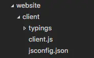
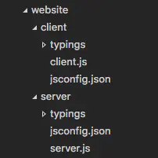

### jsconfigh 或者 tsconfig

> [参考:Xindot-vscode 中的 jsconfig.json](https://www.jianshu.com/p/b0ec870ddfdf)
> webpack 模板里 import 路径中@符号有什么用
> 这是 webpack 的路径别名，相关定义在这里：

##### 什么是 jsconfig.json？

目录中存在 jsconfig.json 文件表示该目录是 JavaScript 项目的根目录。jsconfig.json 文件指定根文件和 JavaScript 语言服务提供的功能选项。

> **提示：** 如果您不使用 JavaScript，则无需担心 jsconfig.json。
> **提示：**jsconfig.json 源于 tsconfig.json，是 TypeScript 的配置文件。jsconfig.json 相当于 tsconfig.json 的“allowJs”属性设置为 true

#### 为什么我需要一个 jsconfig.json 文件？

> 告诉编辑器，该项目是 JavaScript 项目，创造 JavaScript 语言编辑环境以及提供输入智能感知

Visual Studio Code 的 JavaScript 支持可以在两种不同的模式下运行：

- 文件范围 - 没有 jsconfig.json：在此模式下，在 Visual Studio Code 中打开的 JavaScript 文件被视为独立单元。 只要文件 a.js 没有显式引用文件 b.ts（使用///引用指令或 CommonJS 模块），两个文件之间就没有共同的项目上下文。
- 显式项目 - 使用 jsconfig.json：JavaScript 项目是通过 jsconfig.json 文件定义的。 目录中存在此类文件表示该目录是 JavaScript 项目的根目录。 文件本身可以选择列出属于项目的文件，要从项目中排除的文件，以及编译器选项（见下文）。

当您在工作空间中有一个定义项目上下文的 jsconfig.json 文件时，**JavaScript 体验会得到改进**。 因此，当您在新工作空间中打开 JavaScript 文件时，我们提供了一个创建 jsconfig.json 文件的提示。

#### jsconfig.json 的位置

我们通过创建 jsconfig.json 文件将我们代码的这一部分（我们网站的客户端）定义为 JavaScript 项目。 将文件放在 JavaScript 代码的根目录下，如下所示。



在更复杂的项目中，您可能在工作空间中定义了多个 jsconfig.json 文件。 您将需要执行此操作，以便不将一个项目中的代码建议为 IntelliSense 以在另一个项目中进行编码。 下面的插图是一个带有客户端和服务器文件夹的项目，显示了两个单独的 JavaScript 项目。



#### 例子

默认情况下，JavaScript 语言服务将分析并为 JavaScript 项目中的所有文件提供 IntelliSense(智能感知)。 您需要指定要排除或包含的文件，以便提供正确的 IntelliSense。

#### 使用“exclude”属性

exclude 属性（glob 模式）告诉语言服务哪些文件是什么文件，而不是源代码的一部分。 这使性能保持在较高水平。 如果 IntelliSense 速度很慢，请将文件夹添加到排除列表中（如果检测到速度减慢，VS 代码将提示您执行此操作）。

```json
{
	"compilerOptions": {
		"module": "commonjs",
		"target": "es6"
	},
	"exclude": ["node_modules"]
}
```

> **提示：** 您将要排除由构建过程生成的文件（例如，dist 目录）。 这些文件会导致建议显示两次，并会降低 IntelliSense 的速度。

#### 使用“包含”属性

或者，可以使用 include 属性（glob 模式）显式设置项目中的文件。如果不存在 include 属性，则默认为包含目录和子目录中的所有文件。如果指定了 include 属性，则只包括这些文件。下面是一个具有显式 include 属性的示例。

```json
{
	"compilerOptions": {
		"module": "commonjs",
		"target": "es6"
	},
	"include": ["src/**/*"]
}
```

> **提示：** exclude 和 include 中的文件路径是相对于 jsconfig.json 的位置。

#### jsconfig 选项

下面是 jsconfig“compilerOptions”来配置 JavaScript 语言支持。

> **提示：** 不要被 compilerOptions 混淆。 此属性的存在是因为 jsconfig.json 是 tsconfig.json 的后代，后者用于编译 TypeScript。

| 选项                           | 描述                                                                                                                                                         |
| ------------------------------ | ------------------------------------------------------------------------------------------------------------------------------------------------------------ |
| `noLib`                        | Do not include the default library file (lib.d.ts)                                                                                                           |
| `target`                       | Specifies which default library (lib.d.ts) to use. The values are "es3", "es5", "es6", "es2015", "es2016", "es2017", "es2018", "es2019", "es2020", "esnext". |
| `module`                       | Specifies the module system, when generating module code. The values are "amd", "commonJS", "es2015", "es6", "esnext", "none", "system", "umd".              |
| `moduleResolution`             | Specifies how modules are resolved for imports. The values are "node" and "classic".                                                                         |
| `checkJs`                      | Enable type checking on JavaScript files.                                                                                                                    |
| `experimentalDecorators`       | Enables experimental support for proposed ES decorators.                                                                                                     |
| `allowSyntheticDefaultImports` | Allow default imports from modules with no default export. This does not affect code emit, just type checking.                                               |
| `baseUrl`                      | Base directory to resolve non-relative module names.                                                                                                         |
| `paths`                        | Specify path mapping to be computed relative to baseUrl option.                                                                                              |

#### 使用 webpack 别名(让 webpack 别名智能感知)

要使 IntelliSense 使用 webpack 别名，您需要使用 glob 模式指定 paths 键。
例如，对于别名'ClientApp'(或@)：

```json
{
	"compilerOptions": {
		"baseUrl": ".",
		"paths": {
			"ClientApp/*": ["./ClientApp/*"]
		}
	}
}
```

然后使用别名

```js
import Something from 'ClientApp/foo'
```

#### 最佳实践

只要有可能，您应该使用不属于项目源代码的 JavaScript 文件排除文件夹。

> **提示：** 如果工作空间中没有 jsconfig.json，则默认情况下，VS Code 将排除 node_modules 文件夹。

下面是一个将常见项目组件映射到其安装文件夹的表，建议将其排除在外：

| 组件                            | 要排除的文件夹                                  |
| ------------------------------- | ----------------------------------------------- |
| `node`                          | exclude the `node_modules` folder               |
| `webpack`, `webpack-dev-server` | exclude the content folder, for example `dist`. |
| `bower`                         | exclude the `bower_components` folder           |
| `ember`                         | exclude the `tmp` and `temp` folders            |
| `jspm`                          | exclude the `jspm_packages` folder              |

当您的 JavaScript 项目变得太大而性能变慢时，通常是因为像 node_modules 这样的库文件夹。 如果 VS Code 检测到您的项目变得过大，则会提示您编辑排除列表。

> **提示：** 有时无法正确选择更改配置，例如添加或编辑 jsconfig.json 文件。 运行 Reload JavaScript Project 命令应重新加载项目并获取更改。

#### 使用 TypeScript 编译器进行低级编译

当 tsc 用于将 ES6 JavaScript 向下级编译为旧版本时，jsconfig.json 中的以下编译器选项适用：
| 选项 | 描述 |
| ------------------------------- | ----------------------------------------------- |
| module | 指定模块代码生成。 值为“commonjs”，“system”，“umd”，“amd”，“es6”，“es2015” |
| diagnostics| 显示诊断信息。 |
| emitBOM | 在输出文件的开头发出 UTF-8 字节顺序标记（BOM）。 |
| inlineSourceMap | 使用源映射发出单个文件，而不是使用单独的文件。 |
| inlineSources | 在单个文件中将源与源图一起发出; 需要设置--inlineSourceMap。 |
| jsx | 指定 JSX 代码生成：“保留”或“反应”?。 |
| reactNamespace| 指定在针对'react'JSX 发出的目标时为 createElement 和\_\_spread 调用的对象。 |
| mapRoot | 将位置指定为字符串中的 uri，其中调试器应该找到映射文件而不是生成的位置。|
| noEmit| 不发起输出。|
| noEmitHelpers | 不在编译输出中生成自定义辅助函数，如\_\_extends。 |
| noEmitOnError | 如果报告任何类型检查错误，不发起输出。 |
| noResolve | 不将三斜杠引用或模块导入目标解析为输入文件。 |
| outFile| 连接并将输出发送到单个文件。 |
| outDir| 将输出结构重定向到目录。 |
| removeComments| 不向输出发出注释。 |
| rootDir| 指定输入文件的根目录。用于通过--outDir 控制输出目录结构。 |
| sourceMap | 生成相应的'.map'文件。 |
| sourceRoot| 指定调试器应该找到 JavaScript 文件而不是源位置的位置。 |
| stripInternal | 不为具有'@internal'注释的代码发出声明。 |
| watch | 监听输入文件。 |
| emitDecoratorMetadata| 在源中为装饰声明发出设计类型元数据。 |
| noImplicitUseStrict| 不在模块输出中发出“use strict”指令。 |

> [JavaScript 语言服务](https://github.com/Microsoft/TypeScript/wiki/JavaScript-Language-Service-in-Visual-Studio) > [TypeScript tsconfig.json](https://www.w3cschool.cn/typescript/typescript-tsconfig-json.html) > [glob 模式](https://www.cnblogs.com/xdlysk/p/5183604.html) > [glob (programming)](<https://en.wikipedia.org/wiki/Glob_(programming)>)
