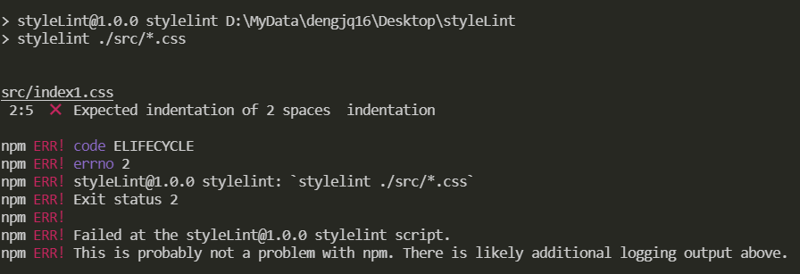
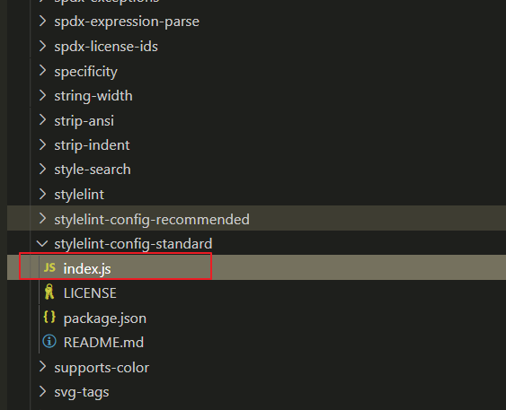
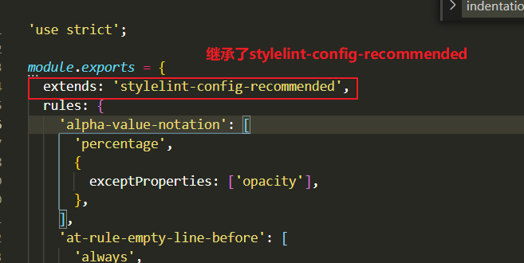

# 使用 stylelint 校验 css 代码（实践）

一个强大的，现代的代码检查工具，可以帮助您避免错误并在您的样式中强制执行约定

> 在阅读该文章前，请先大概了解 stylelint 的基本配置

## 安装

```bash
npm install stylelint --save-dev
```

## 创建 stylelint 配置文件

```bash
echo "module.exports={}" >stylelint.config.js
```

`stylelint.config.js`配置如下

意思就是：指定缩进规则，值为 2 个空格

```js
module.exports = {
	rules: {
		indentation: 2
	}
}
```

`package.json`写入 script

```json
"scripts": {
  "stylelint": "stylelint ./src/*.css"
},
```

在根目录下新建`src`文件夹，在`src`中新建`index.css`，写入如下内容，注意不要格式化，css 属性 **color 的前面不要有空格**

```css
div {
	color: red;
}
```

然后执行`npm run stylelint`，可以看到 stylelint 已经检测出该 css 的写法有问题的如下图


> 由于 stylelint 的 rule 有很多，如果一条一条的配置不就是很繁琐，所以 stylelint 官方推荐了两个共享配置，`stylelint-config-recommended`和`stylelint-config-standard`

## `stylelint-config-standard`

`stylelint-config-standard`是继承于`stylelint-config-recommended`，也就是说在`stylelint-config-recommended`的基础上新增或者更改规则

官方对两者进行了如下的描述：

```txt
建议(recommended)配置仅打开可能错误的规则。标准(standard)配置通过打开 60 个风格规则来扩展它。我们建议您扩展：

- 建议(recommended)配置，如果您使用 prettier 之类的美化排版工具
- 标准(standard)配置，如果您希望 stylelint 强制执行风格约定
```

### 安装`stylelint-config-standard`

```bash
npm install stylelint-config-standard --save-dev
```

安装之后在`node_modules`中找到`stylelint-config-standard`目录，打开目录下的`index.js`

可以看到 如下图


此时 `stylelint.config.js`配置如下

```js
module.exports = {
	extends: 'stylelint-config-standard'
}
```

在执行`npm run stylelint`会发现一样可以检测出错误

## 作为 PostCSS 插件在 postcss.config.js 配置文件中使用

关于postCss使用请参考[官方文档](https://www.postcss.com.cn/)
与任何其他 PostCSS 插件一样，您可以使用 stylelint 作为 PostCSS 插件
具体参考官方文档[stylelint](http://stylelint.docschina.org/user-guide/postcss-plugin/)

在`postcss.config.js`中配置如下
```js
const stylelint = require('stylelint')
module.exports = {
  plugins: {
    'stylelint': {
      config: {
        extends: 'stylelint-config-standard'
        rules: {}
      }
    }
  }
}
```
