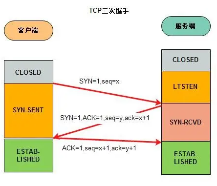
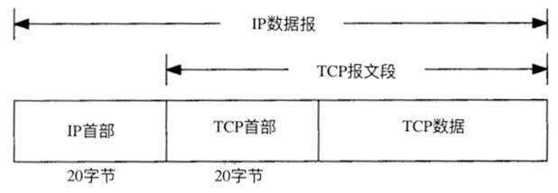
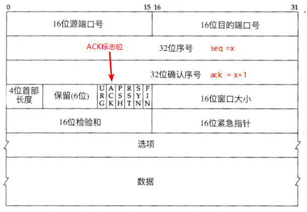

# TCP 三次握手

> 面试中面试官经常问到，东西是挺简单的，但硬是记不住，比较尴尬，所以自己总结一下 tcp 三次握手。

## 总结 SYN + (SYN+ack) + ack 三次数据包

- 第一次握手 client 会发送一个 SYN 数据包到 server 端，这个 SYN 数据包携带的内容有 `SYN = 1，seq = x`。
- 第二次握手 server 收到 client 的请求后会发送一个 SYN+ack 的数据包给 client，让 client 知道服务器已经收到请求，携带的内中为`SYN = 1，seq = y，ACK =1，ack=x+1`。
- 第三次握手 client 收到 server 的请求后会发送一个 ack 的数据包给 server 确认，携带的内中为`seq = x+1,ACK = 1，ack = y+1`。

> ack 确认号通常为接收到 seq+1，是告诉 client 端下一次发送 seq 以 ack 为开始；seq 通常为 ack 的值，如果第一次发送的话，因为 ack 没有值所以会 seq

示意图如下

> 首先注意一下:
> 当发送 syn 标记时将消耗一个序号；
> 发送 fin 标记时将消耗一个序号；
> 数据是每个字节一个序号；

## TCP 报文， TCP 首部，名词解释

- ISN：Initial Sequence Number，初始化序列号，在进行三次握手时，会用 ISN 为 SYN 赋值从而进行序号的初始化。

- SYN：synchronous 建立联机，SYN 标志位，SYN =1 就表示发送要求与接收方建立连接，一般与 ACK 标志位搭配使用。

- seq：Sequence，32 位序号，就是我们常说的序号。假设某时序号为 1000，简单的理解就是发送方告诉接收端“我发送的数据是从第 1000 开始的”。

- ack：acknowledgement，32 位确认序号，就是我们常说的确认序号。确认序号是上一次已经成功接收到序号加 1。还可以理解为接收端告诉发送端下一次想接收开始序号。

- ACK：ACK 标志位，当 ACK 为 1 时表示 32 位确认序号有效。

## 文章参考[TCP 报文详解](https://juejin.cn/post/6958440414336516110)
